# Data visualization
Max Hachemeister
2025-12-22

- [Prerequisites](#prerequisites)
  - [1.2 First steps](#12-first-steps)
  - [1.2.3 Creating a ggplot](#123-creating-a-ggplot)
    - [1.2.4 Adding aesthetics and
      layers](#124-adding-aesthetics-and-layers)
    - [1.2.5 Exercises](#125-exercises)
  - [1.4 Visualizing distributions](#14-visualizing-distributions)
    - [1.4.1 Categorical Variables](#141-categorical-variables)
    - [1.4.2 Numerical variables](#142-numerical-variables)
    - [1.4.3 Exercises](#143-exercises)
  - [1.5 Visualizing relationships](#15-visualizing-relationships)
    - [1.5.1 A numerical and a categorical
      variable](#151-a-numerical-and-a-categorical-variable)
    - [1.5.2 Two categorical variables](#152-two-categorical-variables)
    - [1.5.3 Two numerical variables](#153-two-numerical-variables)
    - [1.5.4 Three or more variables](#154-three-or-more-variables)
    - [1.5.5 Exercises](#155-exercises)
  - [1.6 Saving your plots](#16-saving-your-plots)
    - [1.6.1 Exercises](#161-exercises)
  - [1.7 Common problems](#17-common-problems)
  - [1.8 Summary](#18-summary)

# Prerequisites

``` r
library(tidyverse)
library(palmerpenguins)
library(ggthemes)
```

## 1.2 First steps

Variable  
a quantity, quality, or property that you can measure

Value  
the state of a variable when measured. May change from measurement to
measurement

Observation  
set of measurements under similar conditions. Will contain several
values, each for a different variable. Sometimes also referred to as
“data point”

Tabular data  
set of values, associated with a variable and an observation. It is tidy
if: Each value is in its own cell. Each variable has its own column.
Each observation has its own row

> \[Why now attributes, when we just now learned of variables\]

Check out the `penguins` tibble:

``` r
# Variation 1
penguins
```

    # A tibble: 344 × 8
       species island    bill_length_mm bill_depth_mm flipper_length_mm body_mass_g
       <fct>   <fct>              <dbl>         <dbl>             <int>       <int>
     1 Adelie  Torgersen           39.1          18.7               181        3750
     2 Adelie  Torgersen           39.5          17.4               186        3800
     3 Adelie  Torgersen           40.3          18                 195        3250
     4 Adelie  Torgersen           NA            NA                  NA          NA
     5 Adelie  Torgersen           36.7          19.3               193        3450
     6 Adelie  Torgersen           39.3          20.6               190        3650
     7 Adelie  Torgersen           38.9          17.8               181        3625
     8 Adelie  Torgersen           39.2          19.6               195        4675
     9 Adelie  Torgersen           34.1          18.1               193        3475
    10 Adelie  Torgersen           42            20.2               190        4250
    # ℹ 334 more rows
    # ℹ 2 more variables: sex <fct>, year <int>

``` r
# Variation 2
glimpse(penguins)
```

    Rows: 344
    Columns: 8
    $ species           <fct> Adelie, Adelie, Adelie, Adelie, Adelie, Adelie, Adel…
    $ island            <fct> Torgersen, Torgersen, Torgersen, Torgersen, Torgerse…
    $ bill_length_mm    <dbl> 39.1, 39.5, 40.3, NA, 36.7, 39.3, 38.9, 39.2, 34.1, …
    $ bill_depth_mm     <dbl> 18.7, 17.4, 18.0, NA, 19.3, 20.6, 17.8, 19.6, 18.1, …
    $ flipper_length_mm <int> 181, 186, 195, NA, 193, 190, 181, 195, 193, 190, 186…
    $ body_mass_g       <int> 3750, 3800, 3250, NA, 3450, 3650, 3625, 4675, 3475, …
    $ sex               <fct> male, female, female, NA, female, male, female, male…
    $ year              <int> 2007, 2007, 2007, 2007, 2007, 2007, 2007, 2007, 2007…

``` r
# Variation 3
View(penguins)

# and also run the help page
?penguins
```

    Help on topic 'penguins' was found in the following packages:

      Package               Library
      palmerpenguins        /home/max/R/x86_64-pc-linux-gnu-library/4.5
      datasets              /usr/lib/R/library


    Using the first match ...

## 1.2.3 Creating a ggplot

``` r
# make an empty canvas
ggplot(data = penguins)
```


``` r
# map flipper_length_mm and body_mass_g to the axis
ggplot(
  data = penguins,
  mapping = aes(x = flipper_length_mm, y = body_mass_g)
)
```

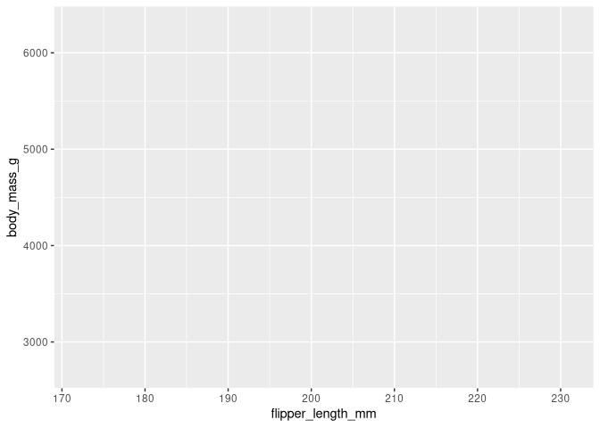

``` r
# add a geom to display the single observations
ggplot(
  data = penguins,
  mapping = aes(x = flipper_length_mm, y = body_mass_g)
) + 
  geom_point()
```

    Warning: Removed 2 rows containing missing values or values outside the scale range
    (`geom_point()`).

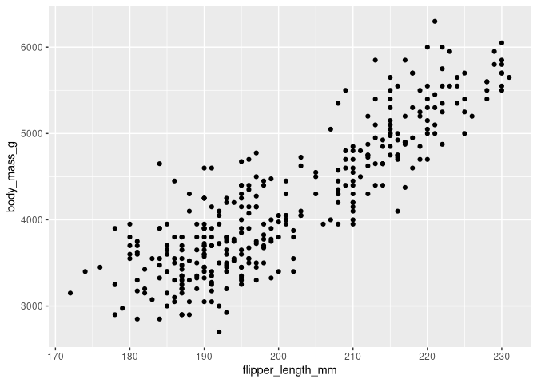

### 1.2.4 Adding aesthetics and layers

> \[“To achieve this, will we need to modify the aesthetic or the geom?
> If you guessed “in the aesthetic mapping, inside of aes()”, you’re
> already getting the hang of creating data visualizations with ggplot2!
> And if not, don’t worry.”\]

    > This question is somewhat misleading compared to the answer. I 'only' guessed aesthetic, and felt demotivated after reading the more specific answer.

Same plot, but this time with points colored by species:

``` r
ggplot(
  data = penguins,
  mapping = aes(x = flipper_length_mm, y = body_mass_g, color = species)
) +
  geom_point()
```

    Warning: Removed 2 rows containing missing values or values outside the scale range
    (`geom_point()`).

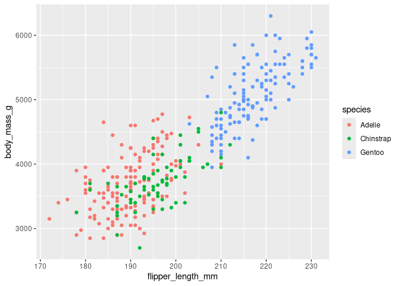

And also add a smooth curve:

``` r
ggplot(
  data = penguins,
  mapping = aes(x = flipper_length_mm, y = body_mass_g, color = species)
) +
  geom_point() +
  geom_smooth(method = "lm")
```

    `geom_smooth()` using formula = 'y ~ x'

    Warning: Removed 2 rows containing non-finite outside the scale range
    (`stat_smooth()`).

    Warning: Removed 2 rows containing missing values or values outside the scale range
    (`geom_point()`).

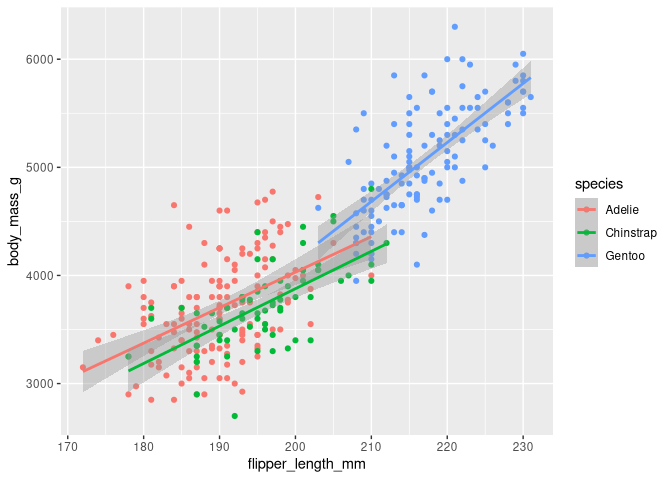

Now to have one overall line I need to write a bit different code:

``` r
ggplot(
  data = penguins,
  mapping = aes(flipper_length_mm, y = body_mass_g)
) +
  # move the color by species down to here
  geom_point(mapping = aes(color = species)) +
  geom_smooth(method = "lm")
```

    `geom_smooth()` using formula = 'y ~ x'

    Warning: Removed 2 rows containing non-finite outside the scale range
    (`stat_smooth()`).

    Warning: Removed 2 rows containing missing values or values outside the scale range
    (`geom_point()`).

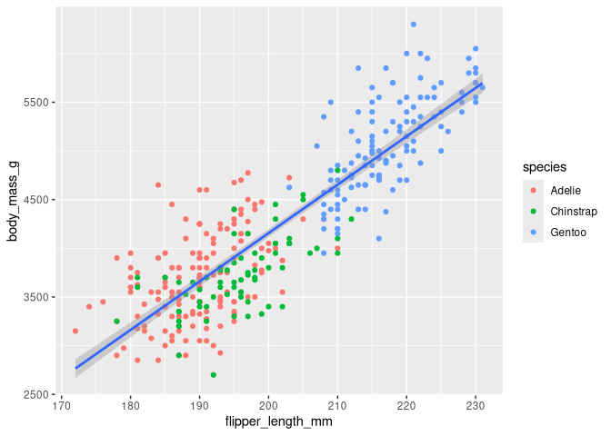

Also add shapes by species for the points, so the plot is sensible for
color blindness:

``` r
ggplot(
  data = penguins,
  mapping = aes(x = flipper_length_mm, y = body_mass_g)
) +
  geom_point(mapping = aes(color = species, shape = species)) +
  geom_smooth(method = "lm")
```

    `geom_smooth()` using formula = 'y ~ x'

    Warning: Removed 2 rows containing non-finite outside the scale range
    (`stat_smooth()`).

    Warning: Removed 2 rows containing missing values or values outside the scale range
    (`geom_point()`).

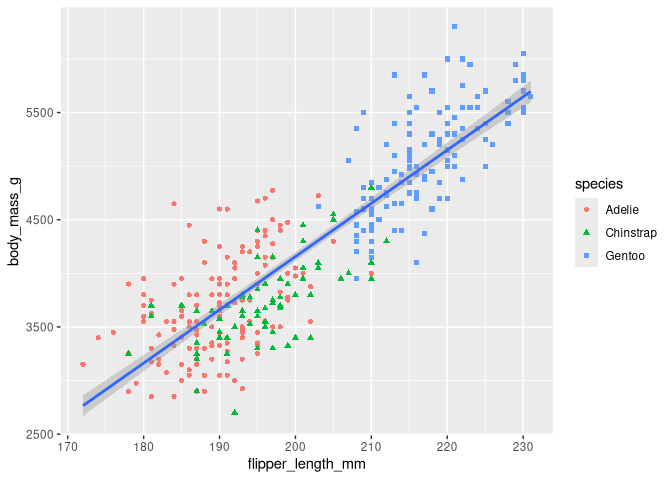

Finishing touches on the plot:

``` r
ggplot(data = penguins,
       mapping = aes(x = flipper_length_mm, y = body_mass_g)
) +
  geom_point(mapping = aes(color = species, shape = species)) +
  geom_smooth(method = "lm") +
  labs(
    title = "Body mass and flipper length",
    subtitle = "Dimensions for Adelie, Chinstrap, and Gentoo Penguins",
    x = "Flipper length (mm)", y = "Body mass (g)",
    color = "Species", shape = "Species"
  ) + 
  scale_color_colorblind()
```

    `geom_smooth()` using formula = 'y ~ x'

    Warning: Removed 2 rows containing non-finite outside the scale range
    (`stat_smooth()`).

    Warning: Removed 2 rows containing missing values or values outside the scale range
    (`geom_point()`).

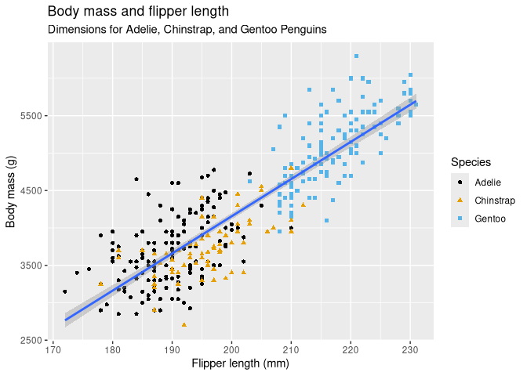

> \[skipped the “mapping” for geom_point in this chunk\]

### 1.2.5 Exercises

#### 1. How many rows are in `penguins` ? How many columns?

``` r
glimpse(penguins)
```

    Rows: 344
    Columns: 8
    $ species           <fct> Adelie, Adelie, Adelie, Adelie, Adelie, Adelie, Adel…
    $ island            <fct> Torgersen, Torgersen, Torgersen, Torgersen, Torgerse…
    $ bill_length_mm    <dbl> 39.1, 39.5, 40.3, NA, 36.7, 39.3, 38.9, 39.2, 34.1, …
    $ bill_depth_mm     <dbl> 18.7, 17.4, 18.0, NA, 19.3, 20.6, 17.8, 19.6, 18.1, …
    $ flipper_length_mm <int> 181, 186, 195, NA, 193, 190, 181, 195, 193, 190, 186…
    $ body_mass_g       <int> 3750, 3800, 3250, NA, 3450, 3650, 3625, 4675, 3475, …
    $ sex               <fct> male, female, female, NA, female, male, female, male…
    $ year              <int> 2007, 2007, 2007, 2007, 2007, 2007, 2007, 2007, 2007…

There are 344 rows and 8 columns in `penguins`.

#### 2. What does the `bill_depth_mm` variable in the `penguins` data frame describe?

``` r
?penguins
```

    Help on topic 'penguins' was found in the following packages:

      Package               Library
      palmerpenguins        /home/max/R/x86_64-pc-linux-gnu-library/4.5
      datasets              /usr/lib/R/library


    Using the first match ...

`bill_depth_mm` describes the bill depth in millimeters of penguins

#### 3. Make a scatterplot of `bill_depth_mm` vs. `bill_length_mm`. That is, make a scatterplot with `bill_depth_mm` on the y-axis and `bill_length_mm` on the x-axis. Describe the relationship between the two variables.

``` r
ggplot(data = penguins,
       mapping = aes(x = bill_length_mm, y = bill_depth_mm)
) +
  geom_point()
```

    Warning: Removed 2 rows containing missing values or values outside the scale range
    (`geom_point()`).

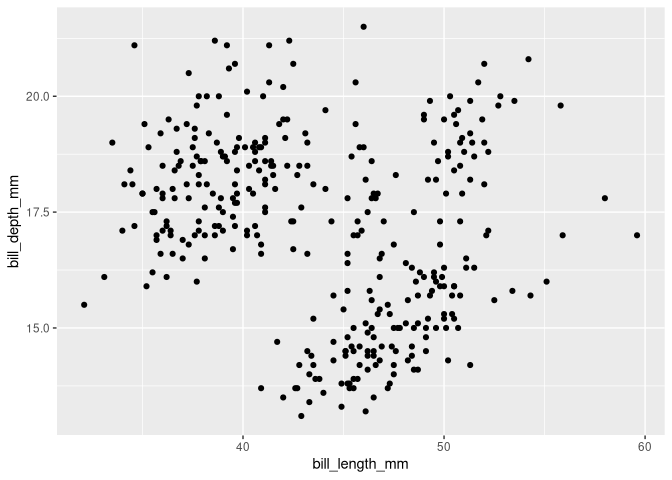

The scatterplot shows a rather random pattern, with a gap between bill
depth 15 to 16 mm. This indicates separate groups in the data. Let’s
also color the points by species and get an overall regression line to
further investigate that assumption:

``` r
ggplot(
  data = penguins,
  mapping = aes(x = bill_length_mm, y = bill_depth_mm)
) +
  geom_point(mapping = aes(color = species)) +
  geom_smooth(method = "lm") +
  # label the plot
  labs(
    title = "Bill depth and bill length",
    subtitle = "Dimensions for Adelie, Chinstrap, and Gentoo Penguins",
    x = "Bill length (mm)",
    y = "Bill depth (mm)",
    color = "Species"
  ) +
  scale_color_colorblind()
```

    `geom_smooth()` using formula = 'y ~ x'

    Warning: Removed 2 rows containing non-finite outside the scale range
    (`stat_smooth()`).

    Warning: Removed 2 rows containing missing values or values outside the scale range
    (`geom_point()`).

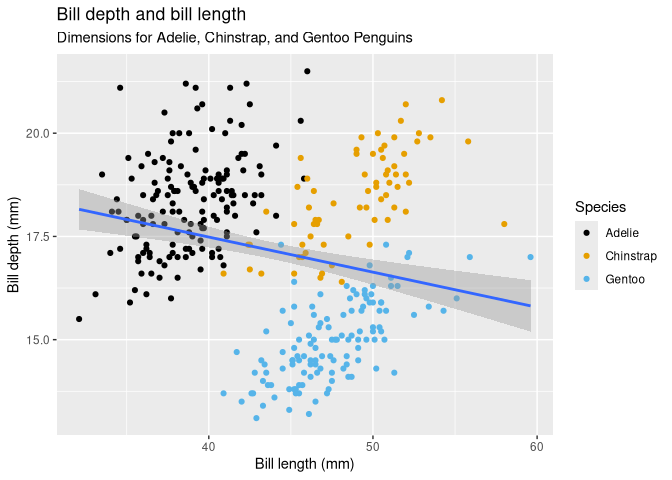

Now the scatterplot exhibits the different groups and their respective
relationship of bill depth and bill length. However the regression line
indicates a negative trend overall, but also doesn’t fit the points
well. Let’s make a smooth line per group:

``` r
ggplot(
  data = penguins,
  mapping = aes(x = bill_length_mm, y = bill_depth_mm,
                color = species)
) +
  geom_point() +
  geom_smooth(method = "lm") +
  labs(
    title = "Bill depth and bill length",
    subtitle = "Dimensions and regression lines for Adelie, Chinstrap and Gentoo Penguins",
    color = "Species",
    x = "Bill length (mm)",
    y = "Bill depth (mm)"
  ) +
  scale_color_colorblind()
```

    `geom_smooth()` using formula = 'y ~ x'

    Warning: Removed 2 rows containing non-finite outside the scale range
    (`stat_smooth()`).

    Warning: Removed 2 rows containing missing values or values outside the scale range
    (`geom_point()`).

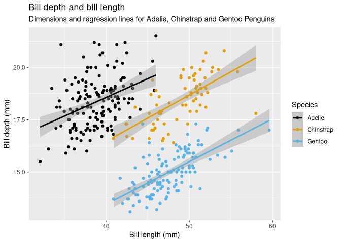

The regression lines now indicate a positive relationship between bill
depth and bill length within each species. Interestingly the Chinstrap
Penguins seem to be separated into two groups.

#### 4. What happens if you make a scatterplot of `species` vs. `bill_depth_mm`? What might be a better choice of geom?

``` r
ggplot(
  data = penguins,
  mapping = aes(x = species, y = bill_depth_mm)
) +
  geom_point()
```

    Warning: Removed 2 rows containing missing values or values outside the scale range
    (`geom_point()`).

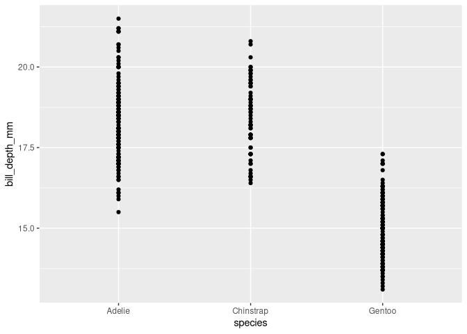

As `species` is a categorical variable, all the points are on a line for
each species. So we can somewhat see that Gentoo Penguins have generally
the shortest bills, there is not much more information in this plot.
Which other geom would be sensible though? So far we the only other geom
we learned is `geom_smooth`. Let’s try that:

``` r
ggplot(
  data = penguins,
  mapping = aes(x = species, y = bill_depth_mm)
) +
  geom_smooth(method = "lm")
```

    `geom_smooth()` using formula = 'y ~ x'

    Warning: Removed 2 rows containing non-finite outside the scale range
    (`stat_smooth()`).

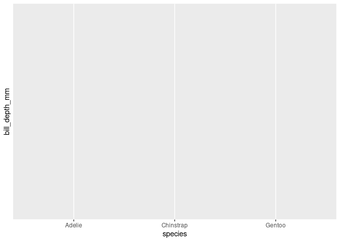

Okay that’s even less informative.

So let’s see what other geoms come up when I type `geom_` into the
console:

``` r
ggplot(
  data = penguins,
  mapping = aes(x = species, y = bill_depth_mm)
) +
geom_bin_2d()
```

    `stat_bin2d()` using `bins = 30`. Pick better value `binwidth`.

    Warning: Removed 2 rows containing non-finite outside the scale range
    (`stat_bin2d()`).

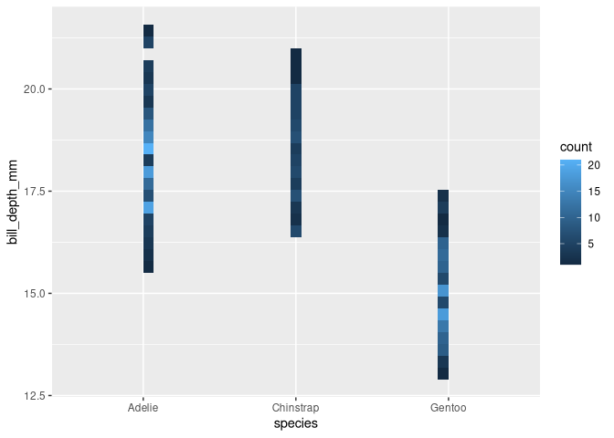

Okay `geom_bin2d()` seems more informative as you can see how many
observations there are for each value of `bill_depth_mm`.

I mean what we also could do, is plotting `bill_depth_mm`
vs. `body_mass` and color by species, aswell as adding a regression
line, like in the first example plot. Let’s try that:

``` r
ggplot(
  data = penguins,
  mapping = aes(x = bill_depth_mm, y = body_mass_g)
) +
  geom_point(mapping = aes(color = species, shape = species)) +
  geom_smooth() +
  scale_color_colorblind() +
  labs(
    title = "Bill depth and body mass",
    subtitle = "Dimensions for Adelie, Chinstrap and Gentoo Penguins",
    x = "Bill depth (mm)",
    y = "Body mass (mm)"
  )
```

    `geom_smooth()` using method = 'loess' and formula = 'y ~ x'

    Warning: Removed 2 rows containing non-finite outside the scale range
    (`stat_smooth()`).

    Warning: Removed 2 rows containing missing values or values outside the scale range
    (`geom_point()`).

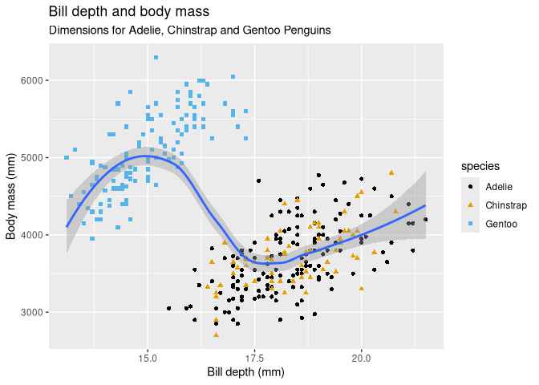

Well now we see that Gentoo Penguins, while being the heaviest, seem to
have generally thinner bills. The regression line is wonky as there seem
to be two groups and those are not linearly related. But yeah. That
should suffice for now.

#### 5. Why does the following give an error and how would you fix it?

``` r
ggplot(data = penguins) +
  geom_point()
```

    Error in `geom_point()`:
    ! Problem while setting up geom.
    ℹ Error occurred in the 1st layer.
    Caused by error in `compute_geom_1()`:
    ! `geom_point()` requires the following missing aesthetics: x and y.

`geom_point` expects the `x` and `y` aesthetics to be mapped. So I would
map for example `bill_depth_mm` and `body_mass_g` to `x` and `y`
respectively.

#### 6. What does the `na.rm` argument do in `geom_point()`? What is the default value of the argument? Create a scatterplot where you successfully use this argument set to `TRUE`.

First check the documentation for geom_point()

``` r
?geom_point()
```

The documentation states that this argument’s default value is `FALSE`.
And further down it explains that this argument removes missing values
either giving out a warning or not. Let’s do a plot and set `na.rm` to
`TRUE`:

``` r
ggplot(
  data = penguins,
  mapping = aes(x = bill_depth_mm, y = body_mass_g, color = species)
) +
  geom_point(na.rm = TRUE)
```

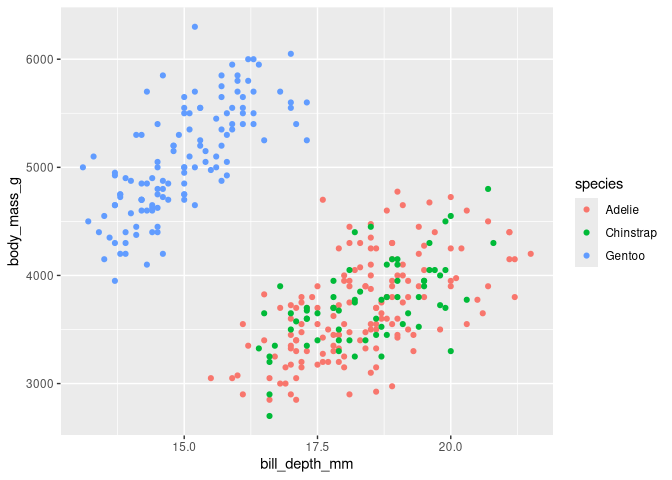

Ah yeah, there is no more warning in the output.

#### 7. Add the following caption to the plot you made in the previous exercise:“Data come from the palmerpenguins package.” Hint: Take a look at the documentation for `labs()`.

Check the documentation for labs

``` r
?labs()
```

According to the documentation there is an `caption` argument, so I will
try this for the plot:

Let’s make it with shapes and for colorblind aswell

``` r
ggplot(
  data = penguins,
  mapping = aes(x = bill_depth_mm, y = body_mass_g, 
                color = species, shape = species)
) +
  # and keep the na.rm for tidy code
  geom_point(na.rm = TRUE) +
  scale_color_colorblind() +
  labs(
    title = "Bill depth and Body mass",
    subtitle = "Dimensions for Adelie, Chinstrap and Gentoo Penguins",
    # here comes the caption
    caption = "Data comes from the palmerpenguins package.",
    x = "Bill depth (mm)",
    y = "Body mass (g)"
  )
```

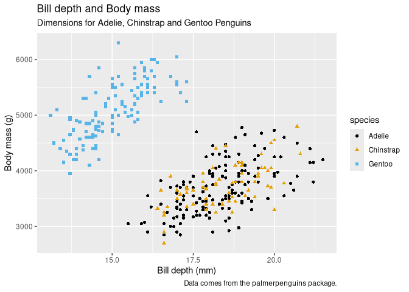

#### 8. Recreate the following visualization. What aesthetic should `bill_depth_mm` be mapped to? And should it be mapped at the global level or at the geom level?

 We see a
scatterplot of `body_mass_g` and `flipper_length_mm` with an added
`geom_smooth()`. Everything else is default. Let’s recreate it:

``` r
ggplot(
  data = penguins,
  mapping = aes(x = flipper_length_mm, y = body_mass_g)
) +
  geom_point() +
  geom_smooth(method = "lm")
```

    `geom_smooth()` using formula = 'y ~ x'

    Warning: Removed 2 rows containing non-finite outside the scale range
    (`stat_smooth()`).

    Warning: Removed 2 rows containing missing values or values outside the scale range
    (`geom_point()`).

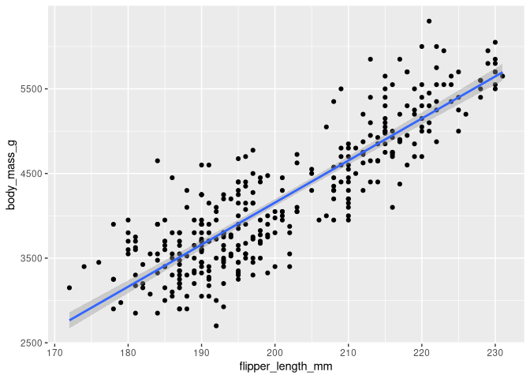

Ah now I see that there is also `bill_depth_mm` mapped to the `color`
aesthetic. Let’s add that aswell:

``` r
ggplot(
  data = penguins,
  mapping = aes(x = flipper_length_mm, y = body_mass_g,
                color = bill_depth_mm)
) +
  geom_point() +
  geom_smooth(method = "lm")
```

    `geom_smooth()` using formula = 'y ~ x'

    Warning: Removed 2 rows containing non-finite outside the scale range
    (`stat_smooth()`).

    Warning: The following aesthetics were dropped during statistical transformation:
    colour.
    ℹ This can happen when ggplot fails to infer the correct grouping structure in
      the data.
    ℹ Did you forget to specify a `group` aesthetic or to convert a numerical
      variable into a factor?

    Warning: Removed 2 rows containing missing values or values outside the scale range
    (`geom_point()`).

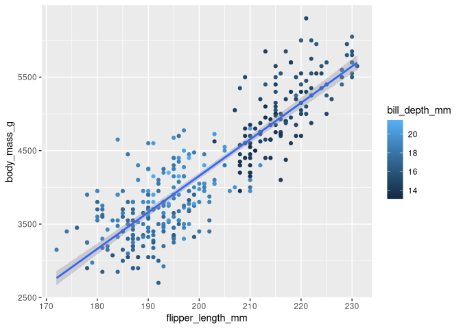

Okay, that seems right. There are many warnings, but the plot got
rendered.

#### 9. Run this code in your head and predict what the output will look like. Then, run the code in R and check your predictions.

``` r
ggplot(
  data = penguins,
  mapping = aes(x = flipper_length_mm, y = body_mass_g, color = island)
) +
  geom_point() +
  geom_smooth(se = FALSE)
```

`geom_point()` and `geom_smooth()` tell me that this will be a
scatterplot of `flipper_length_mm` and `body_mass_g` with a regression
line. Ah and `color = island` tells me that the points will be colored
by `island`, and I think that also makes a regression line for each
`island` group. Let’s see:

``` r
ggplot(
  data = penguins,
  mapping = aes(x = flipper_length_mm, y = body_mass_g, color = island)
) +
  geom_point() +
  geom_smooth(se = FALSE)
```

    `geom_smooth()` using method = 'loess' and formula = 'y ~ x'

    Warning: Removed 2 rows containing non-finite outside the scale range
    (`stat_smooth()`).

    Warning: Removed 2 rows containing missing values or values outside the scale range
    (`geom_point()`).

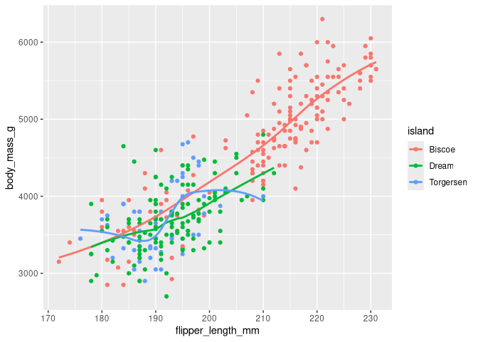

Ah and the `se = false` argument for `geom_smooth()` hides the gray
areas around the regression lines.

#### 10. Will these two graphs look different? Why/why not?

``` r
ggplot(
  data = penguins,
  mapping = aes(x = flipper_length_mm, y = body_mass_g)
) +
  geom_point() +
  geom_smooth()

ggplot() +
  geom_point(
    data = penguins,
    mapping = aes(x = flipper_length_mm, y = body_mass_g)
  ) +
  geom_smooth(
    data = penguins,
    mapping = aes(x = flipper_length_mm, y = body_mass_g)
  )
```

Actually, I think both codes will get the same graph. The layers
`geom_point()` and `geom_smooth()` are the same in each and from
`?geom_point` I could read that geoms also takes the `data` and
`mapping` arguments directly. So while the second code is more to type
both are the same i guess. Let’s see:

``` r
ggplot(
  data = penguins,
  mapping = aes(x = flipper_length_mm, y = body_mass_g)
) +
  geom_point() +
  geom_smooth()
```

    `geom_smooth()` using method = 'loess' and formula = 'y ~ x'

    Warning: Removed 2 rows containing non-finite outside the scale range
    (`stat_smooth()`).

    Warning: Removed 2 rows containing missing values or values outside the scale range
    (`geom_point()`).


``` r
ggplot() +
  geom_point(
    data = penguins,
    mapping = aes(x = flipper_length_mm, y = body_mass_g)
  ) +
  geom_smooth(
    data = penguins,
    mapping = aes(x = flipper_length_mm, y = body_mass_g)
  )
```

    `geom_smooth()` using method = 'loess' and formula = 'y ~ x'

    Warning: Removed 2 rows containing non-finite outside the scale range (`stat_smooth()`).
    Removed 2 rows containing missing values or values outside the scale range
    (`geom_point()`).

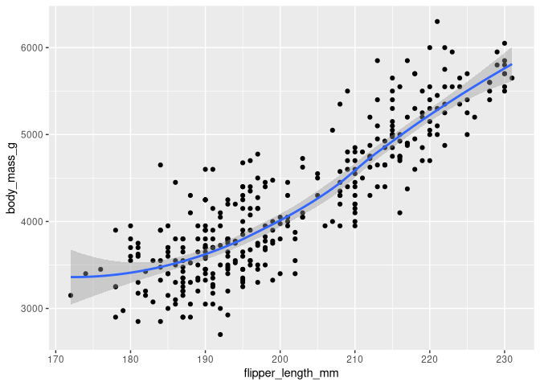

## 1.4 Visualizing distributions

### 1.4.1 Categorical Variables

*Categorical* Variables  
aka *qualitative* variables

can take only a small set of values

mathematical calculations don’t yield practical results

> \[Why not also *qualitative* variable here, like with numerical
> variables?\]

For example `species`. `geom_bar()` is good for that. It counts the
number of observations for each ‘level’ of a category and sizes the bars
accordingly.

``` r
ggplot(
  data = penguins,
  mapping = aes(x = species)
) +
  geom_bar()
```


Use `fct_infreq()` to get the bars ordered by count.

``` r
ggplot(
  data = penguins,
  mapping = aes(x = fct_infreq(species))
) +
  geom_bar()
```

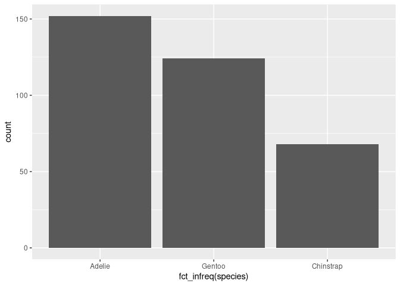

### 1.4.2 Numerical variables

*numerical variables*  
aka *quantitative* variables

can take a wide range of numerical values

you get sensible results when calculating with the values

Example `body_mass_g`. `geom_histogram()` and `geom_density()` are good
for that.

While the histogram is more true to the original distribution of the
data, the density curve usually is more easy to get an intuition of the
distribution. However the line in the plot is only a mathematical
approximation, so some information is not visible. Let’s check it out:

``` r
ggplot(
  data = penguins,
  mapping = aes(x = body_mass_g)
) +
  geom_density()
```

    Warning: Removed 2 rows containing non-finite outside the scale range
    (`stat_density()`).

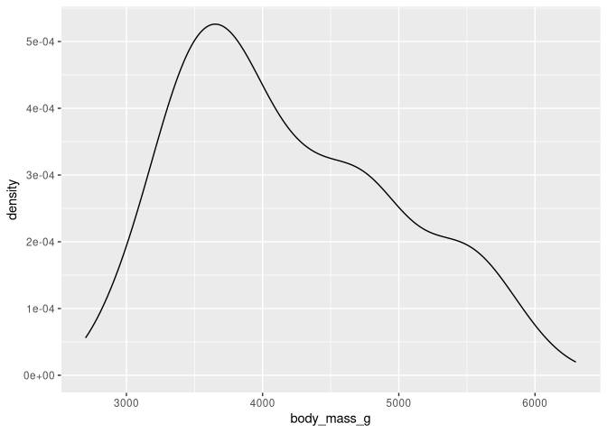

### 1.4.3 Exercises

#### 1. Make a barplot of `species` of `penguins`, where you assing `species` to the `y` aesthetic. How is this plot different?

> > why is scatterplot written as one and bar plot written as two words?

``` r
ggplot(
  data = penguins,
  mapping = aes(y = species)
) +
  geom_bar()
```


Okay and the same plot with `species` on the `x` axis:

``` r
ggplot(
  data = penguins,
  mapping = aes(x = species)
) +
  geom_bar()
```

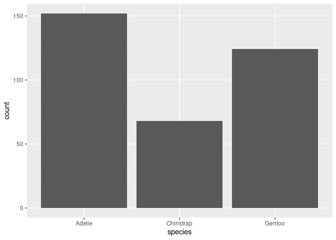

Gotcha, so the bars either go in `x` direction, that is vertical; or
they go in `y` direction, that is, horizontal.

#### 2. How are the following two plots different? Which aesthetic, `color` or `fill`, is more useful for changing the color of the bars?

``` r
ggplot(
  data = penguins,
  mapping = aes(x = species)
) +
  geom_bar(color = "red")
```

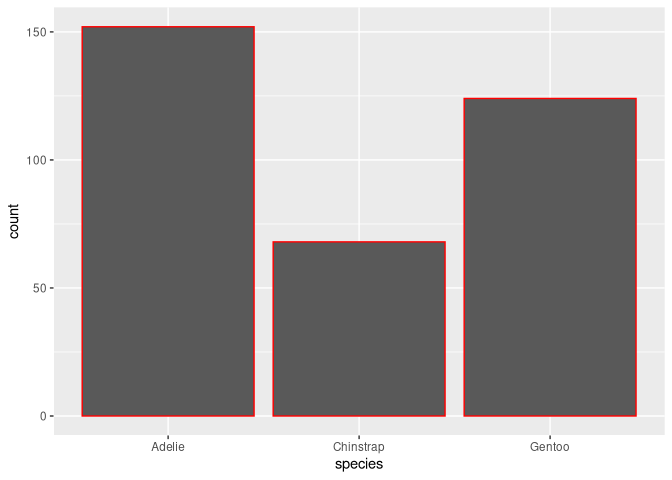

``` r
ggplot(
  data = penguins,
  mapping = aes(x = species)
) +
  geom_bar(fill = "red")
```

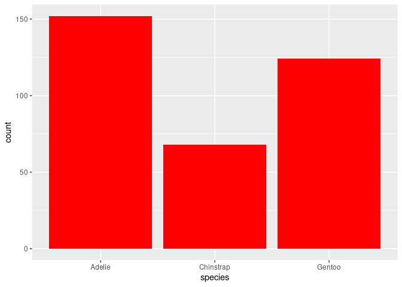

So `color` applies to the outline and `fill` to the area of the geom.

#### 3. What does the `bins` argument in `geom_histogram()` do?

I can remember this. The `bins`… hold up!

So `bins` and `binwidth` are separate arguments. `binwidth` was
explained before. Its value defines how wide each bin is, in the units
of the variable that is mapped to the geom.

I think with `bins` you define how many bins in total you want the data
to be sorted into. Let’s try it by making a histogram with ten bins:

``` r
ggplot(
  data = penguins,
  mapping = aes(x = body_mass_g)
) +
  geom_histogram(bins = 10)
```

    Warning: Removed 2 rows containing non-finite outside the scale range
    (`stat_bin()`).

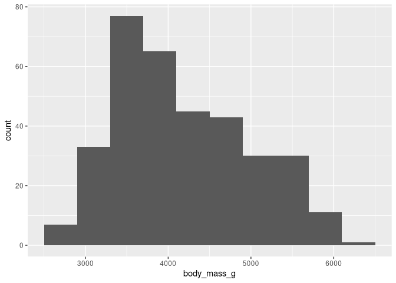

Yep, that’s ten.

#### 4. Make a histogram of the `carat` variable in the `diamonds` dataset that is available when you load the tidyverse package. Experiment with different binwidths. What binwidth reveals the most interesting patterns?

Let’s first take a look at the dataset, to get a sense for the scale of
the `carat` and also check the documentation:

``` r
glimpse(diamonds)
```

    Rows: 53,940
    Columns: 10
    $ carat   <dbl> 0.23, 0.21, 0.23, 0.29, 0.31, 0.24, 0.24, 0.26, 0.22, 0.23, 0.…
    $ cut     <ord> Ideal, Premium, Good, Premium, Good, Very Good, Very Good, Ver…
    $ color   <ord> E, E, E, I, J, J, I, H, E, H, J, J, F, J, E, E, I, J, J, J, I,…
    $ clarity <ord> SI2, SI1, VS1, VS2, SI2, VVS2, VVS1, SI1, VS2, VS1, SI1, VS1, …
    $ depth   <dbl> 61.5, 59.8, 56.9, 62.4, 63.3, 62.8, 62.3, 61.9, 65.1, 59.4, 64…
    $ table   <dbl> 55, 61, 65, 58, 58, 57, 57, 55, 61, 61, 55, 56, 61, 54, 62, 58…
    $ price   <int> 326, 326, 327, 334, 335, 336, 336, 337, 337, 338, 339, 340, 34…
    $ x       <dbl> 3.95, 3.89, 4.05, 4.20, 4.34, 3.94, 3.95, 4.07, 3.87, 4.00, 4.…
    $ y       <dbl> 3.98, 3.84, 4.07, 4.23, 4.35, 3.96, 3.98, 4.11, 3.78, 4.05, 4.…
    $ z       <dbl> 2.43, 2.31, 2.31, 2.63, 2.75, 2.48, 2.47, 2.53, 2.49, 2.39, 2.…

``` r
?diamonds
```

Good, it says `carat` has values from 0.2 to 5.01. So I start with a
`binwidth` of 0.1 and 0.01, to see what histograms I get.

``` r
ggplot(
  data = diamonds,
  mapping = aes(x = carat)
) +
  geom_histogram(binwidth = 0.1)
```

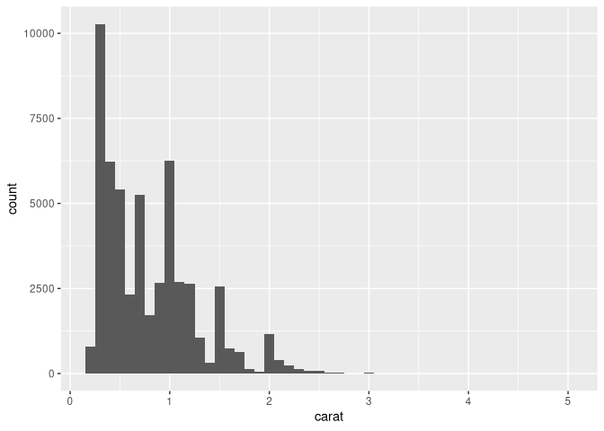

``` r
ggplot(
  data = diamonds,
  mapping = aes(x = carat)
) +
  geom_histogram(binwidth = 0.01)
```


Interesting! There seems to be a pattern. A lot of diamonds are around
values that are a quarter of a carat.

Let’s do two things. One histogram with `binwidth` 0.25 to check if I
read the pattern rigth and one with 0.005 to see whether it repeats on
even lower scale.

``` r
ggplot(
  data = diamonds,
  mapping = aes(x = carat)
) +
  geom_histogram(binwidth = 0.25)
```

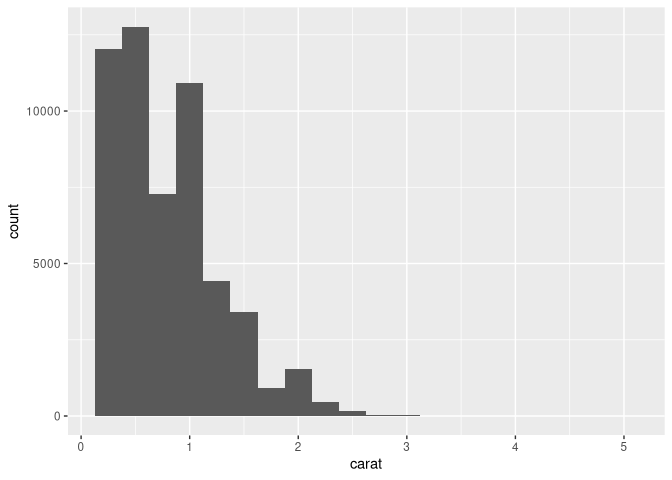

``` r
ggplot(
  data = diamonds,
  mapping = aes(x = carat)
) +
  geom_histogram(binwidth = 0.005)
```

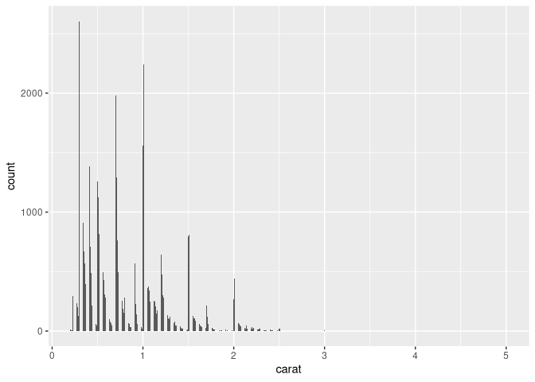

Ahh! The 0.25 did not bring something new. I misinterpreted that. But
check out the 0.005 histogram! There are some empty bins. I guess we
found the minimal carat they could measure, which is 0.01. And it seems
that there are more diamonds on whole carat and quarter fractions. Is
probably a size that buyers like to see.

## 1.5 Visualizing relationships

### 1.5.1 A numerical and a categorical variable

Example, boxplot of body mass and species:

``` r
ggplot(
  data = penguins,
  mapping = aes(x = species, y = body_mass_g)
) +
  geom_boxplot()
```

    Warning: Removed 2 rows containing non-finite outside the scale range
    (`stat_boxplot()`).

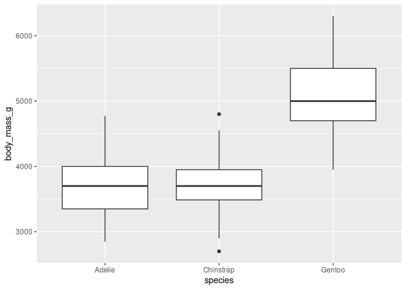

Or alternatively density plots by species:

``` r
ggplot(
  data = penguins,
  mapping = aes(x = body_mass_g, color = species)
) +
  geom_density(linewidth = 0.75)
```

    Warning: Removed 2 rows containing non-finite outside the scale range
    (`stat_density()`).

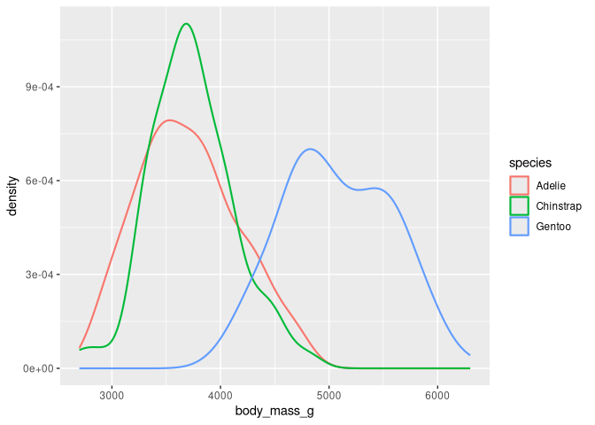

To make it more appealing, add `fill`, but make the overlap visible with
the `alpha` argument:

``` r
ggplot(
  data = penguins,
  mapping = aes(x = body_mass_g, color = species, fill = species)
) +
  geom_density(alpha = 0.5, linewidth = 0.75)
```

    Warning: Removed 2 rows containing non-finite outside the scale range
    (`stat_density()`).

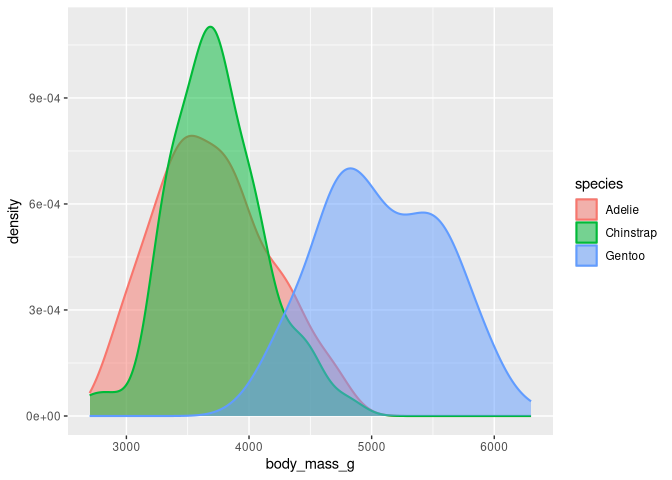

mapping to an aesthetic  
have the visual attribute vary based on the values of the variable

setting an aesthetic  
set the value ‘manually’

### 1.5.2 Two categorical variables

Example, stacked bar plots of `island` and `species`.

First one so you can see the raw counts:

``` r
ggplot(
  data = penguins,
  mapping = aes(x = island, fill = species)
) +
  geom_bar()
```

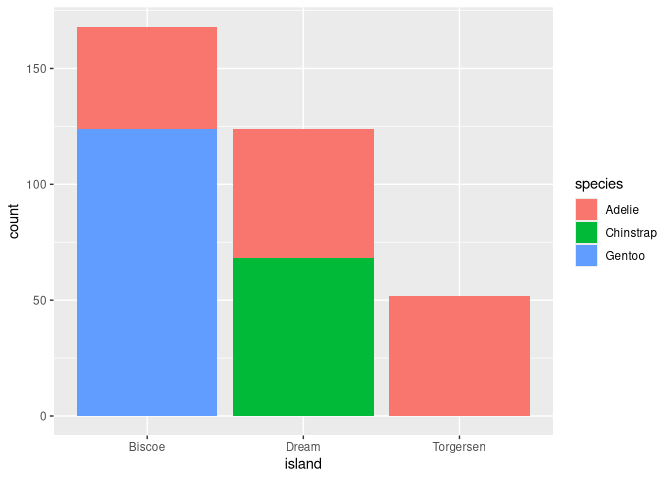

Second one to see the proportions, with `position = "fill"` argument:

``` r
ggplot(
  data = penguins,
  mapping = aes(x = island, fill = species)
) +
  geom_bar(position = "fill")
```

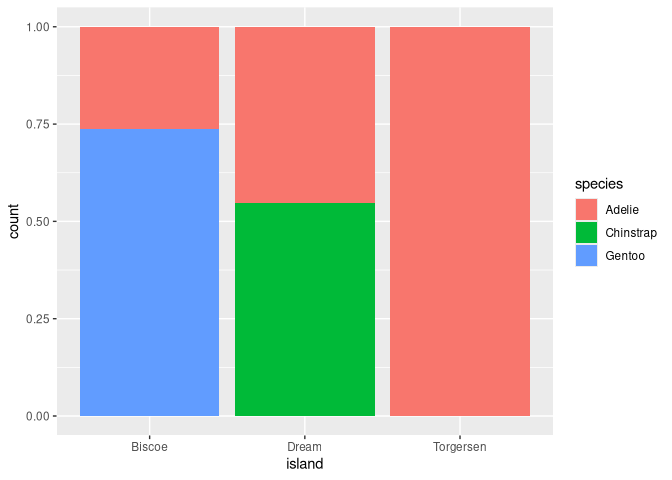

### 1.5.3 Two numerical variables

Example, scatterplot of flipper length and body mass. Just like in
section 1.1 and 1.2

``` r
ggplot(
  data = penguins,
  mapping = aes(x = flipper_length_mm, y = body_mass_g)
) +
  geom_point()
```

    Warning: Removed 2 rows containing missing values or values outside the scale range
    (`geom_point()`).


### 1.5.4 Three or more variables

Example, scatterplot of flipper length and body mass, with colors by
species and shape by island.

``` r
ggplot(
  data = penguins,
  mapping = aes(x = flipper_length_mm, y = body_mass_g,
                color = species, shape = island)
) +
  geom_point()
```

    Warning: Removed 2 rows containing missing values or values outside the scale range
    (`geom_point()`).

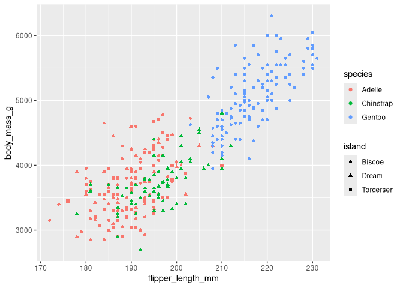

But yeah, that’s pretty busy and relatively less informative.

At this point, splitting the plot into facets with `facet_wrap()` would
be one solution. Note the `~` in the facet wrap function. This is the
*tilde* sign, which is used in R for *formulas*. More on that later
though.

``` r
ggplot(
  data = penguins,
  mapping = aes(x = flipper_length_mm, y = body_mass_g, 
                color = species, shape = species)
) +
  geom_point() +
  facet_wrap(~island)
```

    Warning: Removed 2 rows containing missing values or values outside the scale range
    (`geom_point()`).

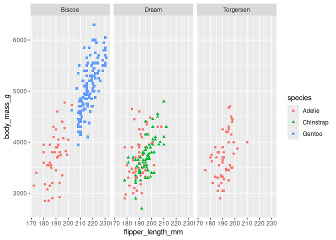

### 1.5.5 Exercises

#### 1. The `mpg` data frame that is bundled with the ggplot2 package contains 234 observations collected by the US Environmental Protection Agency on 38 car models.

- Which variables in `mpg` are categorical?
- Which variables are numerical? Hint: Type `?mpg` to read the
  documentation for the dataset.
- How can you see this information when you run `mpg`?

Read the documentation, `glimpse()` the dataframe and run `mpg`
directly:

``` r
?mpg

glimpse(mpg)
```

    Rows: 234
    Columns: 11
    $ manufacturer <chr> "audi", "audi", "audi", "audi", "audi", "audi", "audi", "…
    $ model        <chr> "a4", "a4", "a4", "a4", "a4", "a4", "a4", "a4 quattro", "…
    $ displ        <dbl> 1.8, 1.8, 2.0, 2.0, 2.8, 2.8, 3.1, 1.8, 1.8, 2.0, 2.0, 2.…
    $ year         <int> 1999, 1999, 2008, 2008, 1999, 1999, 2008, 1999, 1999, 200…
    $ cyl          <int> 4, 4, 4, 4, 6, 6, 6, 4, 4, 4, 4, 6, 6, 6, 6, 6, 6, 8, 8, …
    $ trans        <chr> "auto(l5)", "manual(m5)", "manual(m6)", "auto(av)", "auto…
    $ drv          <chr> "f", "f", "f", "f", "f", "f", "f", "4", "4", "4", "4", "4…
    $ cty          <int> 18, 21, 20, 21, 16, 18, 18, 18, 16, 20, 19, 15, 17, 17, 1…
    $ hwy          <int> 29, 29, 31, 30, 26, 26, 27, 26, 25, 28, 27, 25, 25, 25, 2…
    $ fl           <chr> "p", "p", "p", "p", "p", "p", "p", "p", "p", "p", "p", "p…
    $ class        <chr> "compact", "compact", "compact", "compact", "compact", "c…

``` r
mpg
```

    # A tibble: 234 × 11
       manufacturer model      displ  year   cyl trans drv     cty   hwy fl    class
       <chr>        <chr>      <dbl> <int> <int> <chr> <chr> <int> <int> <chr> <chr>
     1 audi         a4           1.8  1999     4 auto… f        18    29 p     comp…
     2 audi         a4           1.8  1999     4 manu… f        21    29 p     comp…
     3 audi         a4           2    2008     4 manu… f        20    31 p     comp…
     4 audi         a4           2    2008     4 auto… f        21    30 p     comp…
     5 audi         a4           2.8  1999     6 auto… f        16    26 p     comp…
     6 audi         a4           2.8  1999     6 manu… f        18    26 p     comp…
     7 audi         a4           3.1  2008     6 auto… f        18    27 p     comp…
     8 audi         a4 quattro   1.8  1999     4 manu… 4        18    26 p     comp…
     9 audi         a4 quattro   1.8  1999     4 auto… 4        16    25 p     comp…
    10 audi         a4 quattro   2    2008     4 manu… 4        20    28 p     comp…
    # ℹ 224 more rows

The documentation explains the columns further, but does not list the
variable type, while `glimpse()` gives a short overview of the dataframe
and shows the variable type in its second row. You can find this
information also when calling `mpg` directly, then it’s right under each
column header. You have to scroll through the columns though.

In total there are six categorical variables (basically all `<chr>`
columns) and five numerical variables.

The categorical variables are `manufacturer`, `model`, `trans`, `drv`,
`fl` and `class`.

The numerical variables are `displ`, `year`, `cyl`, `cty` and `hwy`.

Well come to think of it, `cyl`, which is the number of cylinders might
count as a categorical variable, as there are usually a few possible
values for that and arithmetic doesn’t seem sensible in that case.

#### 2. Make a scatterplot of `hwy`vs. `displ` using the `mpg` data frame.

> Next, map a third numerical variable to `color`, then `size`, then
> both `color` and `size`, then `shape`. How do these aesthetics behave
> differently for categorical vs. numerical variables?

Scatterplot of `hwy` vs. `displ`. The vs. implicates for me that you
read it like ‘y vs. x’. Well that’s at least a convention I follow.

``` r
ggplot(
  data = mpg,
  mapping = aes(x = displ, y = hwy)
) +
  geom_point()
```

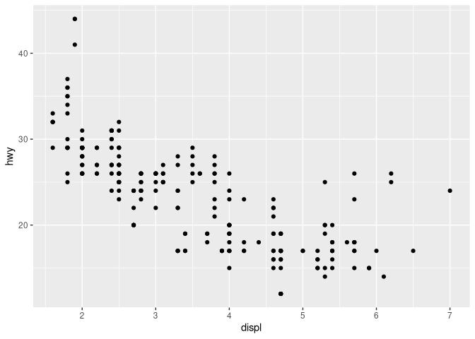

Adding `trans`, a categorical to `color`:

``` r
ggplot(
  data = mpg,
  mapping = aes(x = displ, y = hwy, color = trans)
) +
  geom_point()
```

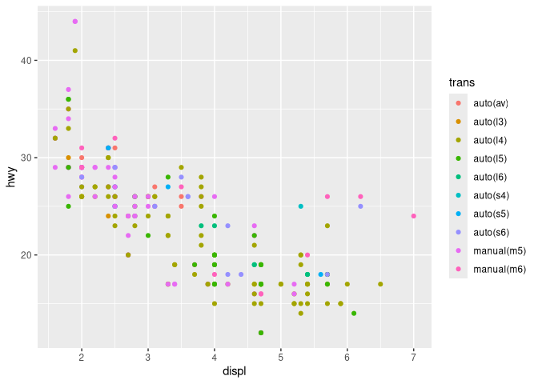

Looks very busy to me. But I can make out that auto(l4) and manual(m5)
seem to be the most common transmission types.

Add `cty` as a numerical variable to `size`.

``` r
ggplot(
  data = mpg,
  mapping = aes(x = displ, y = hwy,
                color = trans, size = cty)
) +
  geom_point()
```

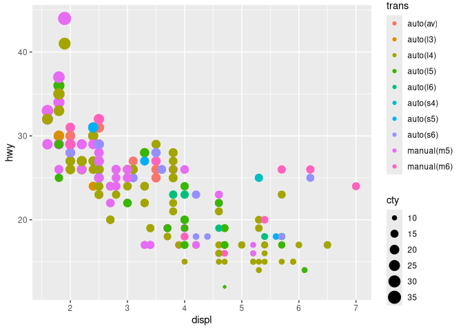

So it seems like it put the numerical variable into bins and then draws
the point size accordingly.

Now map `cty` to both `color` and `size`:

``` r
ggplot(
  data = mpg,
  mapping = aes(x = displ, y = hwy,
                color = cty, size = cty) 
) +
  geom_point()
```

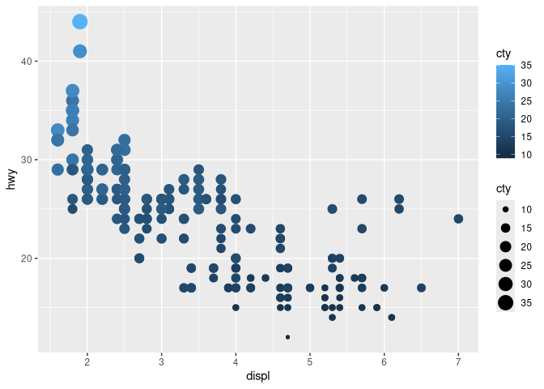

Now we see that `color` and `size` of the points are continuous and the
bins are just in the legend to help you orient.

Now map `cty` only to shape:

``` r
ggplot(
  data = mpg,
  mapping = aes(x = displ, y = hwy,
                shape = cty)
) +
  geom_point()
```

    Error in `geom_point()`:
    ! Problem while computing aesthetics.
    ℹ Error occurred in the 1st layer.
    Caused by error in `scale_f()`:
    ! A continuous variable cannot be mapped to the shape aesthetic.
    ℹ Choose a different aesthetic or use `scale_shape_binned()`.

Ah okay, continuous variables are not by default mapable to `shape`.

#### 3. In the scatterplot of `hwy` vs. `dspl`, what happens if you map a third variable to `linewidth`?

I will map `cty` to `linewidth`. Interesting what will happen, as it’s
just points. So what does `linewidth` even apply to? Let’s see:

``` r
ggplot(
  data = mpg,
  mapping = aes(x = displ, y = hwy)
) +
  geom_point(
    mapping = aes(linewidth = cty)
  )
```

    Warning in geom_point(mapping = aes(linewidth = cty)): Ignoring unknown
    aesthetics: linewidth


Ah, so `linewidth` is unknown for the scatterplot and therefore ignored,
but at least a warning is given.

#### 4. What happens if you map the same variable to multiple aesthetics?

Let’s map `hwy` to `x`, `y` and `color`:

``` r
ggplot(
  data = mpg,
  mapping = aes(x = hwy, y = hwy, color = hwy)
) +
  geom_point()
```

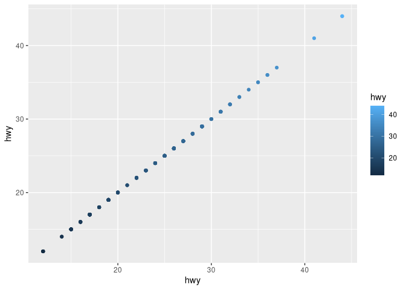

Seems like it did what I asked for. It’s just not much new information.
We can see the distribution a bit.

#### 5. Make a scatterplot of `bill_depth_mm` vs. `bill_length_mm` and color the points by `species`.

> What does adding coloring by species reveal about the relationship
> between these two variables? What about faceting by `species`?

> \[!note\] Why is the second `species` not formated like the other
> occurences?

So there are two visualizations to be done. Let’s start with the
scatterplot:

``` r
ggplot(
  data = penguins,
  mapping = aes(x = bill_length_mm, y = bill_depth_mm, color = species)
) +
  geom_point()
```

    Warning: Removed 2 rows containing missing values or values outside the scale range
    (`geom_point()`).


The colors in the plot make out the distinction between the species. You
can see that the points for each form separate groups in the value
ranges of bill length and bill depth.

Let’s do the facets now! I will keep the coloring, as I think it won’t
harm the appeal of the plot.

``` r
ggplot(
  data = penguins,
  mapping = aes(x = bill_length_mm, y = bill_depth_mm, color = species)
) +
  geom_point() +
  facet_wrap(~ species)
```

    Warning: Removed 2 rows containing missing values or values outside the scale range
    (`geom_point()`).

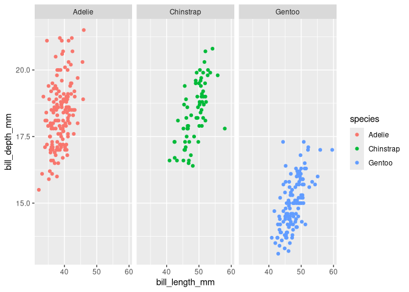

Well you can see the same. The species make up clusters. So Gentoo
penguins have the longest but thinnest bills, while Adelie and Chinstrap
penguins have similarly wide bills, even though Adelies have generally
the shortest bills of all three species.

I think though that you can see the relation of those groups better when
they are all in one plot, whereas the faceting makes the individual
ranges more clear.

#### 6.

> Why does the following yield two separate legends? How would you fix
> it to combine the two legends?

Sample code:

``` r
ggplot(
  data = penguins,
  mapping = aes(
    x = bill_length_mm, y = bill_depth_mm,
    color = species, shape = species
  )
) +
  geom_point() +
  labs(color = "Species")
```

    Warning: Removed 2 rows containing missing values or values outside the scale range
    (`geom_point()`).

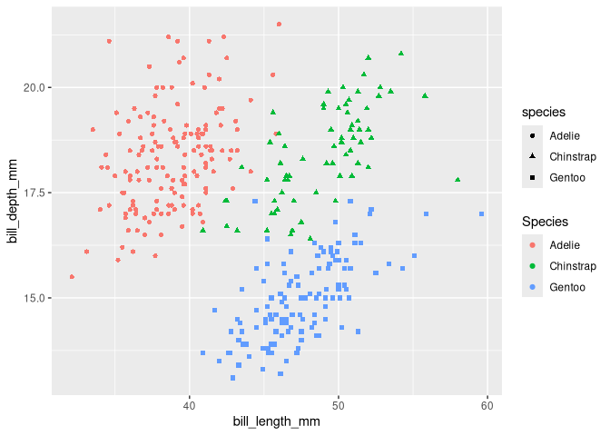

The `labs` makes it so that `shape` and `color` get a different label
for their legends. Maybe if I leave `labs` out, both will become one
legend.

Let’s see:

``` r
ggplot(
  data = penguins,
  mapping = aes(
    x = bill_length_mm, y = bill_depth_mm,
    color = species, shape = species
  )
) +
  geom_point()
```

    Warning: Removed 2 rows containing missing values or values outside the scale range
    (`geom_point()`).


Good, that solved it. And if I wanted to have “Species” with the capital
“S” I would have to set this for both aesthetics in the `labs` function.

``` r
ggplot(
  data = penguins,
  mapping = aes(
    x = bill_length_mm, y = bill_depth_mm,
    color = species, shape = species
  )
) +
  geom_point() +
  labs(
    color = "Species",
    shape = "Species"
  )
```

    Warning: Removed 2 rows containing missing values or values outside the scale range
    (`geom_point()`).

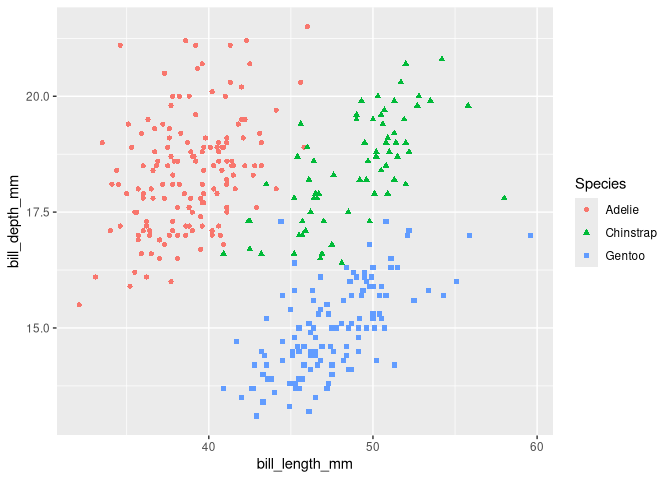

#### 7.

> Create the two following stacked bar plots. Which question can you
> answer with the first one? Which question can you answer with the
> second one?

``` r
ggplot(penguins, aes(x = island, fill = species)) +
  geom_bar(position = "fill")
```


``` r
ggplot(penguins, aes(x = species, fill = island)) +
  geom_bar(position = "fill")
```

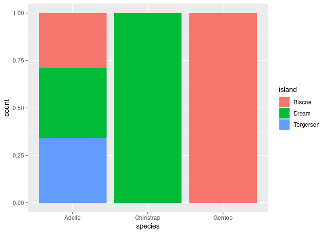

The first stacked bar plot answers the question: “What is the proportion
of species among all the penguins of each island?”

The second stacked bar plot answers the question: “How are the penguins
of each species distributed among the islands?”

You can roughly read it like: “What is the proportion of `fill` among
all the ‘observational units’ for each `x`?”

So in case of the second plot it would read: “What is the proportion of
`islands` among all the ‘penguins’ for each `species`?

Yeah, you’d have to tweak it a bit case by case.

## 1.6 Saving your plots

### 1.6.1 Exercises

#### 1.

> Run the following lines of code. Which of the two plots is saved as
> `mpg-plot.png`? Why?

Example code:

``` r
ggplot(mpg, aes(x = class)) +
  geom_bar()
```

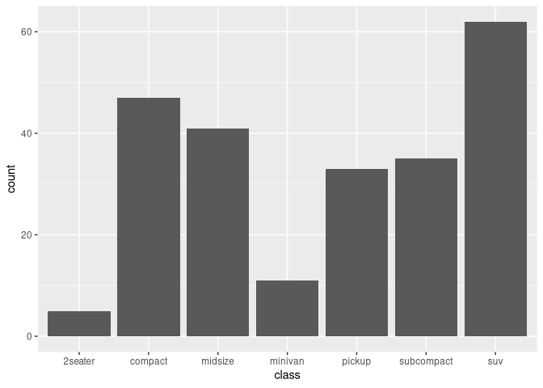

``` r
ggplot(mpg, aes(x = cty, y = hwy)) +
  geom_point()
```

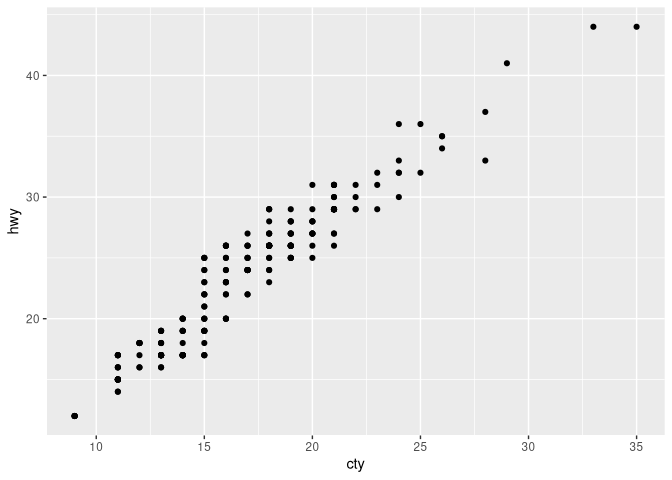

``` r
ggsave("mpg-plot.png")
```

    Saving 7 x 5 in image

Can I display this plot somehow from the file? Well the internet search
shows some extra packages that can do that, but not natively within
R-Studio. So you will have to believe me that

I’ve checked the `mpg-plot.png` and it shows the scatterplot.

This reflects the mentioned behavior of `ggsave()`, saving the most
recently rendered plot, which in the code above is the scatterplot, if
you were to run the chunk as a whole.

#### 2.

> What do you need to change in the code above to save the plot as a PDF
> instead of a PNG? How could you find out what types of image files
> would work in `ggsave()`?

To see what `ggsave()` can do, I would check the documentation like so:

``` r
?ggsave()
```

There it says for the argument “device”, that it can do a bunch of
formats, e.g. “eps”, “ps”, *“pdf”*, “png” and such. In the end it’s also
described that it guesses the format based on the `filename` extension,
if not stated otherwise in the “device” argument.

So to save the plot as “pdf” I can just name the output accordingly:

``` r
ggplot(mpg, aes(x = cty, y = hwy)) +
  geom_point()
```


``` r
ggsave("mpg-plot.pdf")
```

    Saving 7 x 5 in image

## 1.7 Common problems

Writing code that works on first try takes practice and consideration.
Mostly something won’t work. Be patient and read your code line by line.
Check the documentation. In the beginning especially the code examples
for the functions. Also the web search, or LLM can be of good help, if
you’re stuck.

## 1.8 Summary

I’ve made my first scatterplot, that would be ready to publish. With
labels, shapes and colorblind coloring.

I learned the basics of `ggplot()`. How it makes up plots of different
layers and how to control those elements, by either “setting” them
directly, or “mapping” them to express values of a variable.

I learned several plots to visualize different relationships, for
example, two numeric variables, one categorical and one numeric and
such.

So i also learned about the distinction between those variable types.

In the end I learned to save a plot and how to troubleshoot my code a
bit.
