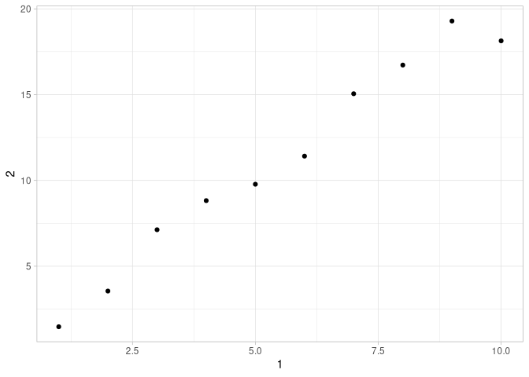

# Data import
Max Hachemeister
2025-12-29

- [Prerequisites](#prerequisites)
  - [Reading data from a file](#reading-data-from-a-file)
    - [Other arguments](#other-arguments)
    - [Other file types](#other-file-types)
    - [Exercises](#exercises)
  - [Controlling column types](#controlling-column-types)
  - [Reading data from multiple
    files](#reading-data-from-multiple-files)
  - [Writing to a file](#writing-to-a-file)
  - [Data entry](#data-entry)
  - [Summary](#summary)

# Prerequisites

``` r
library(tidyverse)
```

    ── Attaching core tidyverse packages ──────────────────────── tidyverse 2.0.0 ──
    ✔ dplyr     1.1.4     ✔ readr     2.1.5
    ✔ forcats   1.0.1     ✔ stringr   1.5.2
    ✔ ggplot2   4.0.0     ✔ tibble    3.3.0
    ✔ lubridate 1.9.4     ✔ tidyr     1.3.1
    ✔ purrr     1.1.0     
    ── Conflicts ────────────────────────────────────────── tidyverse_conflicts() ──
    ✖ dplyr::filter() masks stats::filter()
    ✖ dplyr::lag()    masks stats::lag()
    ℹ Use the conflicted package (<http://conflicted.r-lib.org/>) to force all conflicts to become errors

``` r
theme_set(theme_light())
```

## Reading data from a file

Get the `students` csv.

``` r
students <- 
  read_csv("https://pos.it/r4ds-students-csv")
```

    Rows: 6 Columns: 5
    ── Column specification ────────────────────────────────────────────────────────
    Delimiter: ","
    chr (4): Full Name, favourite.food, mealPlan, AGE
    dbl (1): Student ID

    ℹ Use `spec()` to retrieve the full column specification for this data.
    ℹ Specify the column types or set `show_col_types = FALSE` to quiet this message.

``` r
students
```

    # A tibble: 6 × 5
      `Student ID` `Full Name`      favourite.food     mealPlan            AGE  
             <dbl> <chr>            <chr>              <chr>               <chr>
    1            1 Sunil Huffmann   Strawberry yoghurt Lunch only          4    
    2            2 Barclay Lynn     French fries       Lunch only          5    
    3            3 Jayendra Lyne    N/A                Breakfast and lunch 7    
    4            4 Leon Rossini     Anchovies          Lunch only          <NA> 
    5            5 Chidiegwu Dunkel Pizza              Breakfast and lunch five 
    6            6 Güvenç Attila    Ice cream          Lunch only          6    

Have `"N/A"` be recognized as actual `NA`:

``` r
students <- 
  read_csv(
    "https://pos.it/r4ds-students-csv",
    # Need to also add 'empty' fields as `NA`
    na = c("N/A", "")
  )
```

    Rows: 6 Columns: 5
    ── Column specification ────────────────────────────────────────────────────────
    Delimiter: ","
    chr (4): Full Name, favourite.food, mealPlan, AGE
    dbl (1): Student ID

    ℹ Use `spec()` to retrieve the full column specification for this data.
    ℹ Specify the column types or set `show_col_types = FALSE` to quiet this message.

``` r
students
```

    # A tibble: 6 × 5
      `Student ID` `Full Name`      favourite.food     mealPlan            AGE  
             <dbl> <chr>            <chr>              <chr>               <chr>
    1            1 Sunil Huffmann   Strawberry yoghurt Lunch only          4    
    2            2 Barclay Lynn     French fries       Lunch only          5    
    3            3 Jayendra Lyne    <NA>               Breakfast and lunch 7    
    4            4 Leon Rossini     Anchovies          Lunch only          <NA> 
    5            5 Chidiegwu Dunkel Pizza              Breakfast and lunch five 
    6            6 Güvenç Attila    Ice cream          Lunch only          6    

Convert row names from strings to values:

``` r
students |> 
  rename(
    student_id = `Student ID`,
    full_name = `Full Name`
  )
```

    # A tibble: 6 × 5
      student_id full_name        favourite.food     mealPlan            AGE  
           <dbl> <chr>            <chr>              <chr>               <chr>
    1          1 Sunil Huffmann   Strawberry yoghurt Lunch only          4    
    2          2 Barclay Lynn     French fries       Lunch only          5    
    3          3 Jayendra Lyne    <NA>               Breakfast and lunch 7    
    4          4 Leon Rossini     Anchovies          Lunch only          <NA> 
    5          5 Chidiegwu Dunkel Pizza              Breakfast and lunch five 
    6          6 Güvenç Attila    Ice cream          Lunch only          6    

Or use the `clean_names()` function from the `janitor` package which
cleans all the other column names in the same call:

``` r
students |> 
  janitor::clean_names()
```

    # A tibble: 6 × 5
      student_id full_name        favourite_food     meal_plan           age  
           <dbl> <chr>            <chr>              <chr>               <chr>
    1          1 Sunil Huffmann   Strawberry yoghurt Lunch only          4    
    2          2 Barclay Lynn     French fries       Lunch only          5    
    3          3 Jayendra Lyne    <NA>               Breakfast and lunch 7    
    4          4 Leon Rossini     Anchovies          Lunch only          <NA> 
    5          5 Chidiegwu Dunkel Pizza              Breakfast and lunch five 
    6          6 Güvenç Attila    Ice cream          Lunch only          6    

`meal_plan` are a fixed set of known values, i. e. “factors”. So convert
the column type:

``` r
students |> 
  janitor::clean_names() |> 
  mutate(meal_plan = factor(meal_plan))
```

    # A tibble: 6 × 5
      student_id full_name        favourite_food     meal_plan           age  
           <dbl> <chr>            <chr>              <fct>               <chr>
    1          1 Sunil Huffmann   Strawberry yoghurt Lunch only          4    
    2          2 Barclay Lynn     French fries       Lunch only          5    
    3          3 Jayendra Lyne    <NA>               Breakfast and lunch 7    
    4          4 Leon Rossini     Anchovies          Lunch only          <NA> 
    5          5 Chidiegwu Dunkel Pizza              Breakfast and lunch five 
    6          6 Güvenç Attila    Ice cream          Lunch only          6    

`age` column is still character because one value is literal “five”.
Convert to numerical:

``` r
students <- 
  students |> 
    janitor::clean_names() |> 
    mutate(
      meal_plan = factor(meal_plan),
      age = parse_number(if_else(age == "five", "5", age))
    )
```

### Other arguments

`read_csv` uses the first row as the column names by default:

``` r
read_csv(
  "a,b,c
  1,2,3
  4,5,6"
)
```

    # A tibble: 2 × 3
          a     b     c
      <dbl> <dbl> <dbl>
    1     1     2     3
    2     4     5     6

Sometimes there are metadata rows in the raw csv. Use the argument
`skip = n` to drop the first `n` rows, or `comment = "#"` to drop lines
with a given prefix:

``` r
read_csv(
  "Some first line
  And also a second line
  y,x,z
  1,2,3
  4,5,6",
  skip = 2
)
```

    # A tibble: 2 × 3
          y     x     z
      <dbl> <dbl> <dbl>
    1     1     2     3
    2     4     5     6

``` r
read_csv(
  ";; First line comment
  ;; Second line comment
  x,y,z
  1,2,3
  4,5,6
  7,8,9",
  comment = ";;"
)
```

    # A tibble: 3 × 3
          x     y     z
      <dbl> <dbl> <dbl>
    1     1     2     3
    2     4     5     6
    3     7     8     9

The other way around use `col_names = FALSE` when there are no column
names in the raw data:

``` r
read_csv(
  "1,2,3
  4,5,6
  7,8,9",
  col_names = FALSE
)
```

    # A tibble: 3 × 3
         X1    X2    X3
      <dbl> <dbl> <dbl>
    1     1     2     3
    2     4     5     6
    3     7     8     9

At this point you can also pass the column names as a character vector:

``` r
read_csv(
  "1,2,3
  4,5,6
  7,8,9",
  col_names = c("x", "y", "z")
)
```

    Rows: 3 Columns: 3
    ── Column specification ────────────────────────────────────────────────────────
    Delimiter: ","
    dbl (3): x, y, z

    ℹ Use `spec()` to retrieve the full column specification for this data.
    ℹ Specify the column types or set `show_col_types = FALSE` to quiet this message.

    # A tibble: 3 × 3
          x     y     z
      <dbl> <dbl> <dbl>
    1     1     2     3
    2     4     5     6
    3     7     8     9

### Other file types

There are also special functions for other file types which are worth
considering. Check the `read_csv` documentation.

### Exercises

#### 1. What function would you use to read a file where fields were separated with “\|”?

The documentation for `read_csv()` states that the base function for
this is `read_delim()` in which the delimiter can be specified:

``` r
read_delim(
  "x|y|z
  1|2|3
  4|5|6",
  delim = "|"
)
```

    # A tibble: 2 × 3
      x         y     z
      <chr> <dbl> <dbl>
    1 "  1"     2     3
    2 "  4"     5     6

#### 2. Apart from `file`, `skip`, and `comment`, what other arguments do `read_csv()` and `read_tsv()` have in common?

Check the documentation again:

``` r
?read_csv
?read_tsv
```

`read_csv()` and `read_tsv()` share all the same arguments, as they are
variations of the same base function, that is `read_delim()`.

#### 3. What are the most important arguments to `read_fwf()`?

Check the documentation:

``` r
?read_fwf
```

From what I’ve gathered `read_fwf()` need at least the filename or
string, the `col_position` argument which defines where/how the columns
are split up ,and the `col_names` argument wich can be part to the
`col_position` values.

#### 4. Sometimes strings in a CSV file contain commas.

> To prevent them from causing problem, they need to be sorrounded by a
> quoting character, like `"` or `'`. By default, `read_csv()` assumes
> that the quoting character will be `"`. To read the following text
> into a data frame, what argument to `read_csv()` do you need to
> specify? \`“x,y,‘a,b’”

I think I need to specify the non standard quote with the `quote`
argument:

``` r
read_csv(
  "x,y\n1,'a,b'",
  quote = "\'"
)
```

    # A tibble: 1 × 2
          x y    
      <dbl> <chr>
    1     1 a,b  

#### 5. Identify what is wrong with each of the following incline CSV files. What happens when you run the code?

1.  Here we have a missing value for the third column which should be
    `c`.

    ``` r
    read_csv("a,b\n1,2,3\n4,5,6")
    ```

        # A tibble: 2 × 2
              a     b
          <dbl> <dbl>
        1     1    23
        2     4    56

    Interesting, so the values for the second and third column were
    concatenated into one instead of dropping the third column
    completely.

2.  This time there are more values in the third row than there are
    actual columns defined in the heading row. I guess as before the
    values will be concatenated so the second row will be `1,2,NA` and
    the third row will be `1,2,34`. Let’s see:

    ``` r
    read_csv("a,b,c\n1,2\n1,2,3,4")
    ```

        # A tibble: 2 × 3
              a     b     c
          <dbl> <dbl> <dbl>
        1     1     2    NA
        2     1     2    34

3.  In this csv there is only one entry in the second row which is also
    half quoted with a `"` in front. I think this either won’t work, or
    it will put a string `"1` as value:

    ``` r
    read_csv("a,b\n\"1")
    ```

        # A tibble: 0 × 2
        # ℹ 2 variables: a <chr>, b <chr>

    Yeah, it read the heading row, but then gave no further inputs. Odd,
    because I would think `"\"1"` would at least result in a string
    `"1`.

4.  The rows of this csv have different data types; one is characters,
    and the other is integers. I think this will give a warning -or
    error-, or just keep the rows that are of the same type as the first
    one found.

    ``` r
    read_csv("a,b\n1,2\na,b")
    ```

        # A tibble: 2 × 2
          a     b    
          <chr> <chr>
        1 1     2    
        2 a     b    

    Haha, sure it just reads all the values as strings. That’s sensible.

5.  Here the separator is `;` instead of `,` which shouldn’t bother the
    function. Ah well but as `read_csv()` is used it should not work.

    ``` r
    read_csv("a;b\n1;3")
    ```

        # A tibble: 1 × 1
          `a;b`
          <chr>
        1 1;3  

    Sure, just read is as strings and then single rows. :-)

So `read_csv()` will do anything to get the data into R. Probably so you
can do the wrangling as soon as possible within R. Might be a good idea,
but is something to be aware of.

#### 6. Practice referring to non-syntactic names in the following data frame by:

1.  Extracting the variable called `1`.
2.  Plotting a scatterplot of `1` vs. `2`.
3.  Creating a new column called `3`, which is `2` divided by `1`.
4.  Renaming the columns to `one`, `two`, and `three`.

``` r
annoying <- 
  tibble(
    `1` = 1:10,
    `2` = `1` * 2 + rnorm(length(`1`))
  )
```

1.  Extracting the variable called `1`.

    ``` r
    annoying |> 
      select(`1`)
    ```

        # A tibble: 10 × 1
             `1`
           <int>
         1     1
         2     2
         3     3
         4     4
         5     5
         6     6
         7     7
         8     8
         9     9
        10    10

2.  Plotting a scatterplot of `1` vs. `2`.

    ``` r
    annoying |> 
      ggplot(
        aes(`1`, `2`)
      ) +
      geom_point()
    ```

    

3.  Creating a new column called `3`, which is `2` divided by `1`.

    ``` r
    annoying |> 
      mutate(`3` = `2` / `1`)
    ```

        # A tibble: 10 × 3
             `1`   `2`   `3`
           <int> <dbl> <dbl>
         1     1  1.47  1.47
         2     2  3.55  1.78
         3     3  7.13  2.38
         4     4  8.82  2.21
         5     5  9.78  1.96
         6     6 11.4   1.90
         7     7 15.1   2.15
         8     8 16.7   2.09
         9     9 19.3   2.14
        10    10 18.1   1.81

4.  Renaming the columns to `one`, `two`, and `three`.

    ``` r
    annoying |> 
      mutate(`3` = `2` / `1`) |> 
        rename(
          `one` = `1`,
          `two` = `2`,
          `three` = `3`
        )
    ```

        # A tibble: 10 × 3
             one   two three
           <int> <dbl> <dbl>
         1     1  1.47  1.47
         2     2  3.55  1.78
         3     3  7.13  2.38
         4     4  8.82  2.21
         5     5  9.78  1.96
         6     6 11.4   1.90
         7     7 15.1   2.15
         8     8 16.7   2.09
         9     9 19.3   2.14
        10    10 18.1   1.81

## Controlling column types

When columns turn out to be character, even though you ‘know’ they are
something different, specify to the column type and check the warning
message to see why it was read as a string:

``` r
simple_csv <-
  "x
  10
  .
  20
  30"

read_csv(
  simple_csv,
  col_types = "d"
)
```

    Warning: One or more parsing issues, call `problems()` on your data frame for details,
    e.g.:
      dat <- vroom(...)
      problems(dat)

    # A tibble: 4 × 1
          x
      <dbl>
    1    10
    2    NA
    3    20
    4    30

Check the error:

``` r
problems()
```

And correct it in the original call:

``` r
read_csv(
  simple_csv,
  col_types = "d",
  na = "."
)
```

    # A tibble: 4 × 1
          x
      <dbl>
    1    10
    2    NA
    3    20
    4    30

Yes, it also worked before, but adressing the warning messages helps you
be aware of what you really want from the code.

## Reading data from multiple files

If the data is spread across several files, but at least with the same
column layout, you can directly get them into a single dataframe by
putting their paths into a vector:

``` r
sales_files <- 
  c(
    "https://pos.it/r4ds-01-sales",
    "https://pos.it/r4ds-02-sales",
    "https://pos.it/r4ds-03-sales"
  )

read_csv(
  sales_files,
  id = "file"
)
```

    Rows: 19 Columns: 6
    ── Column specification ────────────────────────────────────────────────────────
    Delimiter: ","
    chr (1): month
    dbl (4): year, brand, item, n

    ℹ Use `spec()` to retrieve the full column specification for this data.
    ℹ Specify the column types or set `show_col_types = FALSE` to quiet this message.

    # A tibble: 19 × 6
       file                         month     year brand  item     n
       <chr>                        <chr>    <dbl> <dbl> <dbl> <dbl>
     1 https://pos.it/r4ds-01-sales January   2019     1  1234     3
     2 https://pos.it/r4ds-01-sales January   2019     1  8721     9
     3 https://pos.it/r4ds-01-sales January   2019     1  1822     2
     4 https://pos.it/r4ds-01-sales January   2019     2  3333     1
     5 https://pos.it/r4ds-01-sales January   2019     2  2156     9
     6 https://pos.it/r4ds-01-sales January   2019     2  3987     6
     7 https://pos.it/r4ds-01-sales January   2019     2  3827     6
     8 https://pos.it/r4ds-02-sales February  2019     1  1234     8
     9 https://pos.it/r4ds-02-sales February  2019     1  8721     2
    10 https://pos.it/r4ds-02-sales February  2019     1  1822     3
    11 https://pos.it/r4ds-02-sales February  2019     2  3333     1
    12 https://pos.it/r4ds-02-sales February  2019     2  2156     3
    13 https://pos.it/r4ds-02-sales February  2019     2  3987     6
    14 https://pos.it/r4ds-03-sales March     2019     1  1234     3
    15 https://pos.it/r4ds-03-sales March     2019     1  3627     1
    16 https://pos.it/r4ds-03-sales March     2019     1  8820     3
    17 https://pos.it/r4ds-03-sales March     2019     2  7253     1
    18 https://pos.it/r4ds-03-sales March     2019     2  8766     3
    19 https://pos.it/r4ds-03-sales March     2019     2  8288     6

To spare you typing all the filenames individually you can use this also
with `list.files()` to get the list of all the files in a folder, that
match what you are looking for. But filemanagement in R is a jam for its
own.

## Writing to a file

Use `write_csv()` or `write_tsv()` to write your dataframes back to
disk. Problem is that these files do not save the column type. The
`write_rds()` function solves that, but you can also use the
`write_parquet()` function. Both save the data as binary files with
metadata, which are faster to read.

## Data entry

Entry data column-wise:

``` r
tibble(
  x = c(1, 2, 5),
  y = c("h", "m", "g"),
  z = c(.08, .83, .60)
)
```

    # A tibble: 3 × 3
          x y         z
      <dbl> <chr> <dbl>
    1     1 h      0.08
    2     2 m      0.83
    3     5 g      0.6 

Entry data row-wise:

``` r
tribble(
  ~x, ~y, ~z,
  1, "h", .08,
  2, "m", .83,
  3, "g", .60
)
```

    # A tibble: 3 × 3
          x y         z
      <dbl> <chr> <dbl>
    1     1 h      0.08
    2     2 m      0.83
    3     3 g      0.6 

## Summary

In this chapter I’ve learned how to read data from `csv` files of
different forms like comma-, tab- or something else-separated
structures. I learned the different datatypes columns can have, how R
idetifies those, and how I can troubleshoot if it did not work. I became
aware of different file types to write my new dataframes back to, and
their respective pros and cons. I now know how to read in files in
batch, instead of typing them in manually.
