# Layers
Max Hachemeister
2026-01-04

- [Prerequisites](#prerequisites)
  - [Aesthetic mappings](#aesthetic-mappings)
    - [Exercises](#exercises)
  - [Geometric objects](#geometric-objects)
    - [Exercises](#exercises-1)
  - [Facets](#facets)
    - [Exercises](#exercises-2)

# Prerequisites

``` r
library(tidyverse)
```

    ── Attaching core tidyverse packages ──────────────────────── tidyverse 2.0.0 ──
    ✔ dplyr     1.1.4     ✔ readr     2.1.6
    ✔ forcats   1.0.1     ✔ stringr   1.6.0
    ✔ ggplot2   4.0.1     ✔ tibble    3.3.0
    ✔ lubridate 1.9.4     ✔ tidyr     1.3.2
    ✔ purrr     1.2.0     
    ── Conflicts ────────────────────────────────────────── tidyverse_conflicts() ──
    ✖ dplyr::filter() masks stats::filter()
    ✖ dplyr::lag()    masks stats::lag()
    ℹ Use the conflicted package (<http://conflicted.r-lib.org/>) to force all conflicts to become errors

``` r
theme_set(theme_light())
```

## Aesthetic mappings

### Exercises

#### 1. Create a scatterplot of `hwy` vs. `displ` where the points are pink filled in triangles.

I usually do `y` vs. `x` as a convention, where `y` is the variable to
be explained and `x` the one in relation to that.

``` r
mpg |> 
  ggplot(aes(x = displ, y = hwy)) +
  geom_point(
    shape = 17,
    color = "pink"
  )
```

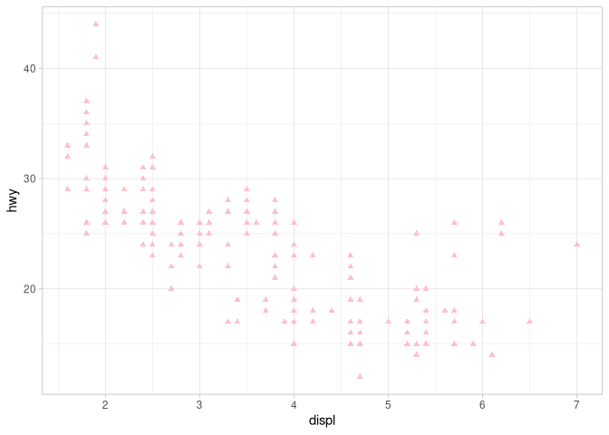

Interestingly the “filled” triangle shape also uses the `color`, instead
of `fill`.

#### 2. Why did the following code not result in a plot with blue points?

> ``` r
> ggplot(mpg) +
> geom_point(aes(x = displ, y = hwy, color = "blue))
> ```

This might be because the color is mapped as an aesthetic, hence
dynamically changing instead of being set for every point. Let’s see
what happens when the `color` mapping is outside of the `aes()`
function.

``` r
mpg |> 
  ggplot(aes(x = displ, y = hwy), color = "blue")
```

    Warning in fortify(data, ...): Arguments in `...` must be used.
    ✖ Problematic argument:
    • color = "blue"
    ℹ Did you misspell an argument name?

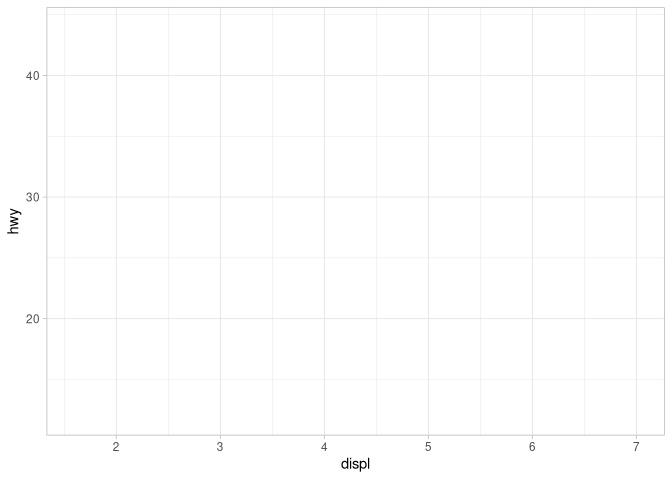

Okay this did not work. The `aes()` function has to be in the actual
`ggplot()` function, and not as part of the geom.

What happens, when the whole `aes()` call is put into the `ggplot()`
function:

``` r
mpg |> 
  ggplot(aes(x = displ, y = hwy, color = "blue")) +
  geom_point()
```

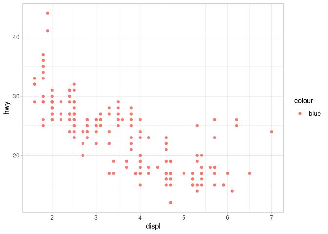

Almost there. I think the `aes()` always expects to be mapped to a
column of a dataframe, or at least to a vector with several values.
That’s why just mapping the single value of `"blue"` to `color` does not
result in actually blue points for the geom.

I think I can either set the `"blue"` directly within the geom, or leave
it in `ggplot()`, but outside of `aes()`, so that it will be passed down
to all following geom calls.

I will try both here:

``` r
# Specify color within geom
mpg |> 
  ggplot(aes(x = displ, y = hwy)) +
  geom_point(color = "blue")
```

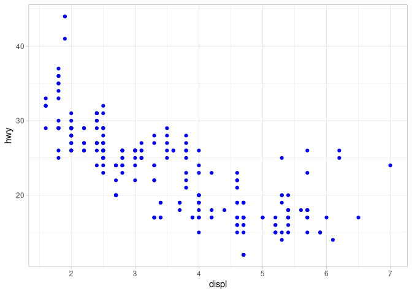

``` r
# Set color in ggplot, but outside of aes() to be passed down.
mpg |> 
  ggplot(aes(x = displ, y = hwy), color = "blue") +
  geom_point()
```

    Warning in fortify(data, ...): Arguments in `...` must be used.
    ✖ Problematic argument:
    • color = "blue"
    ℹ Did you misspell an argument name?

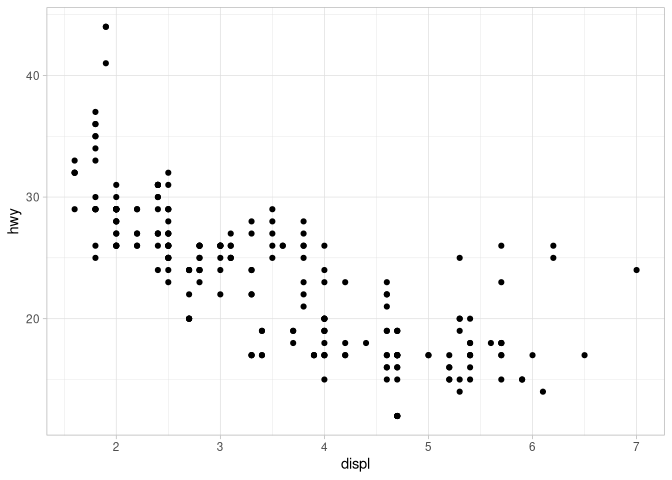

Aha, It only works directly in the geom function. Good to know.

#### 3. What does the `stroke` aesthetic do? What shapes does it work with?

> Hint: use `?geom_point`

The documentation states that `stroke` defines the width of the
“borders” of shapes that have these, like 21.

Let’s see:

``` r
# Make one version
mpg |> 
  ggplot(aes(displ, hwy)) +
  # Set is in the geom as I just learnedn
  geom_point(
    shape = 21,
    stroke = 1
  )
```

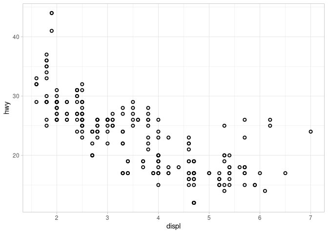

``` r
# And another version to see the difference
mpg |> 
  ggplot(aes(displ, hwy)) +
  # Set is in the geom as I just learnedn
  geom_point(
    shape = 21,
    stroke = 2
  )
```

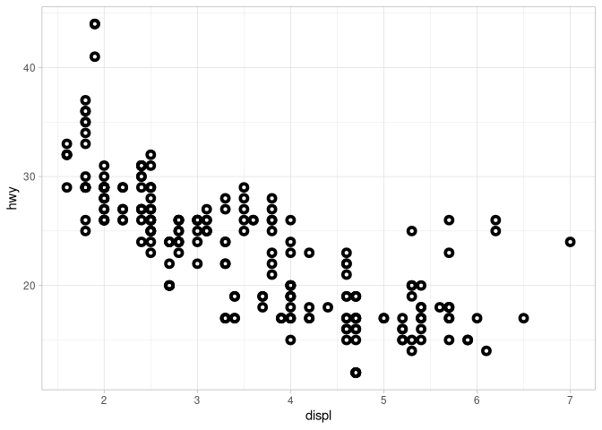

#### 4. What happens if you map an aesthetic to something other than a variable name, like `aes(color = displ < 5)`?

> Note, you’ll also need to specify x and y.

Let’s see:

``` r
mpg |> 
  ggplot(aes(displ, hwy, color = displ < 5)) +
  geom_point(
    # I kept this because I like the appearance
    shape = 21,
    stroke = 1
  )
```

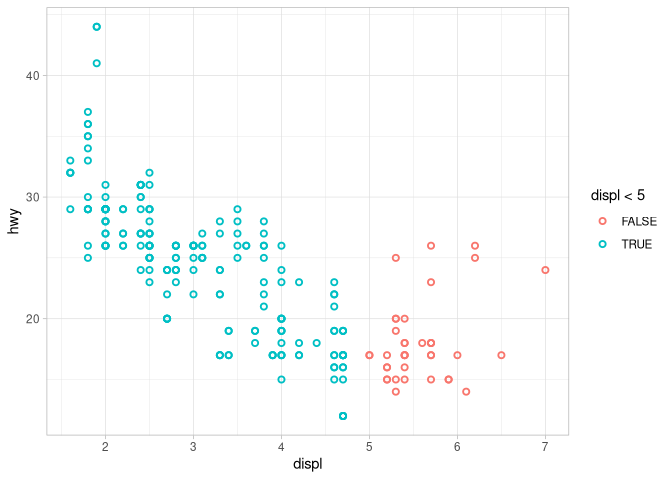

Nice, just as I found in exercise 2, mapping an aesthetic in `aes()`
works with at least two values. And the `displ < 5` check resulted in a
vector with `TRUE` and `FALSE` values, which `aes()` in turn could
interpret and map to the `color` aesthetic.

## Geometric objects

### Exercises

#### 1. What geom would you use to draw a line chart?

> A Boxplot? A histogram? An area chart?

You can find all the answers in the text of the sections above.

Linechart, `geom_line()`:

``` r
mpg |> 
  ggplot(aes(displ, hwy)) +
  geom_line()
```

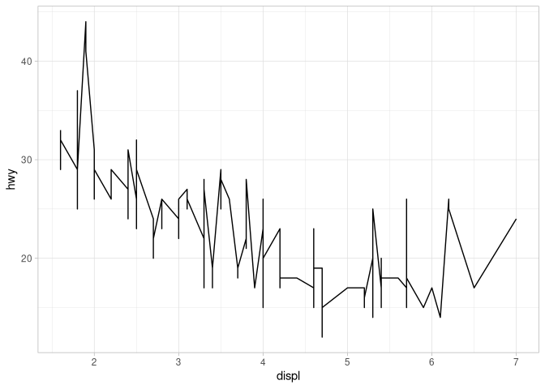

Yeah it’s ugly, but it’s a linechart nevertheless.

Boxplot, `geom_boxplot()`:

``` r
mpg |> 
  # Using drv here, to one boxplot per drive train type.
  ggplot(aes(drv, hwy)) +
  geom_boxplot()
```

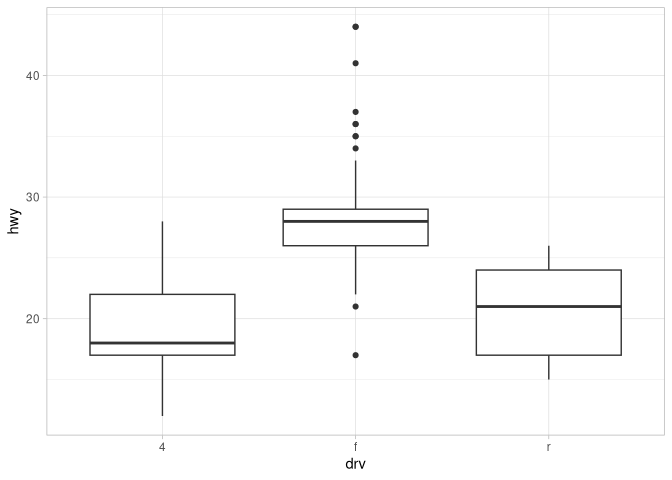

Histogram, `geom_histogram()`:

``` r
mpg |> 
  ggplot(aes(hwy)) + 
  geom_histogram(binwidth = 2)
```

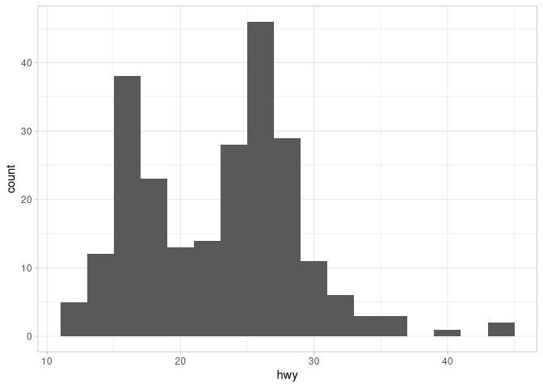

Okay, area chart ist new. Maybe something like `geom_area()`?

``` r
mpg |> 
  # Added fill aesthetic to distinguish areas.
  ggplot(aes(hwy, displ, fill = drv)) +
  geom_area()
```

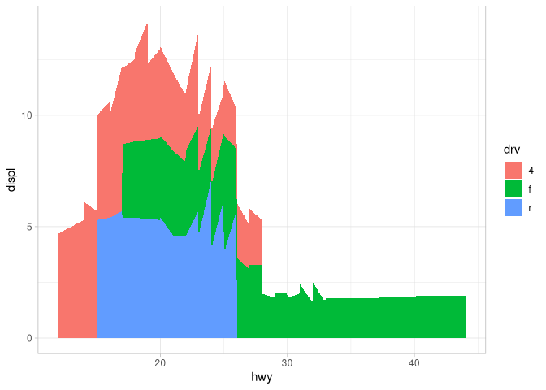

Also not pretty, but an area chart.

#### 2. Earlier in this chapter we used `show.legend` without explaining it:

> ``` r
> ggplot(mpg, aes(x = displ, y = hwy)) +
>   geom_smooth(aes(color = drv), show.legend = FALSE)
> ```

> What does `show.legend = FALSE` do here? What happens if you remove
> it? Why do you think we used it earlier?

What does the code do:

``` r
# show.legend = FALSE
mpg |> 
  ggplot(aes(displ, hwy)) +
  geom_smooth(aes(color = drv), show.legend = FALSE)
```

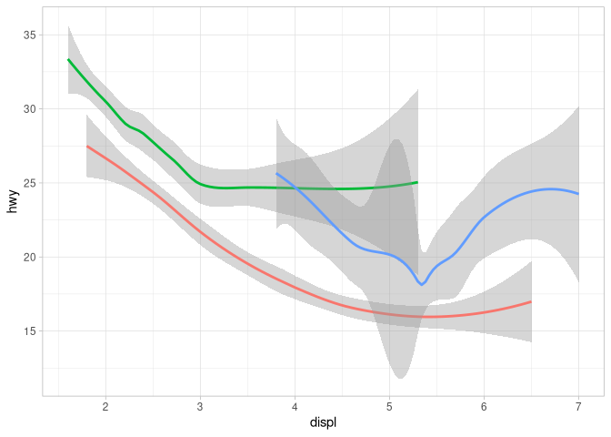

``` r
# show.legend = TRUE
mpg |> 
  ggplot(aes(displ, hwy)) +
  geom_smooth(aes(color = drv), show.legend = TRUE)
```


The `show.legend` argument of the `geom_smooth()` function defines
whether a legend for the lines is displayed. It was used earlier to drop
the legend so that the three plots have the same general look.

#### 3. What does the `se` argument to `geom_smooth()` do?

The documentation `?geom_smooth()` states “Display confidence band…”

Let’s see what it does:

``` r
# se = TRUE
mpg |> 
  ggplot(aes(displ, hwy)) +
  geom_smooth(aes(color = drv), se = TRUE)
```

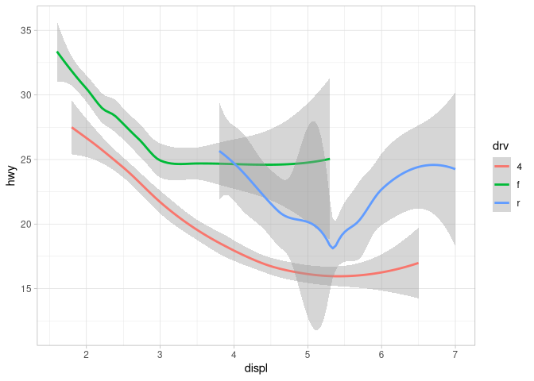

``` r
# se = FALSE
mpg |> 
  ggplot(aes(displ, hwy)) +
  geom_smooth(aes(color = drv), se = FALSE)
```

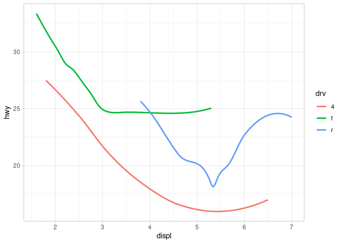

The `se` argument of the `geom_smooth()` defines whether the grey areas
around the lines are shown.

#### 4. Recreate the R code necessary to generate the following graphs.

> Note that wherever a categorical variable is used in the plot, it’s
> `drv`.

The top left plot is a scatterplot of black points with a smooth line
without grey area on top:

``` r
mpg |> 
  ggplot(aes(displ, hwy)) +
  geom_point() +
  geom_smooth(se = FALSE)
```

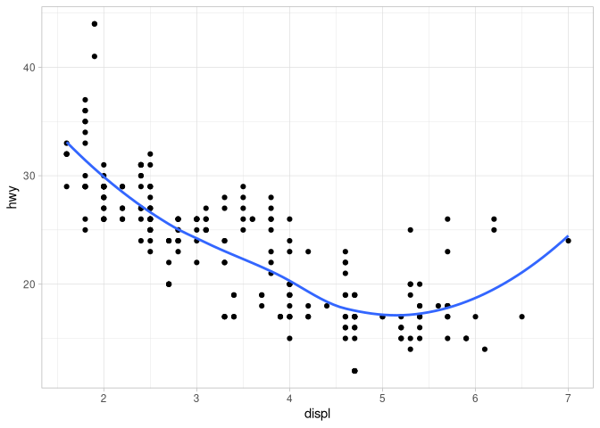

The top right plot is the same plot, this time with a smooth for each
type of `drv`:

``` r
mpg |> 
  ggplot(aes(displ, hwy)) +
  geom_point() +
  geom_smooth(aes(group = drv), se = FALSE)
```

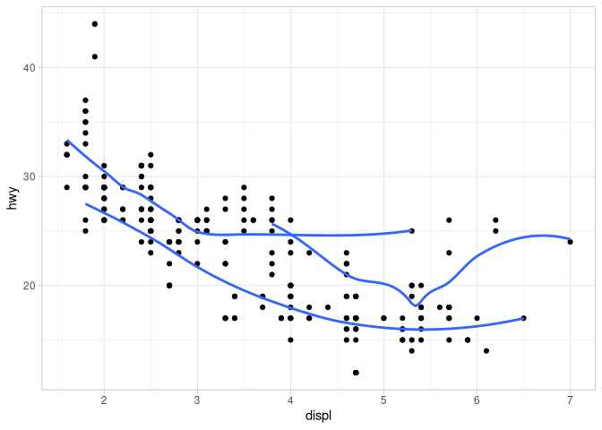

The middle left plot is a scatterplot colored by `drv` with colored
smooth lines for each `drv` on top as well, and as for this and all
plots in this exercise the area around the smooth lines was dropped:

``` r
mpg |> 
  ggplot(aes(displ, hwy, color = drv)) +
  geom_point() +
  geom_smooth(se = FALSE)
```

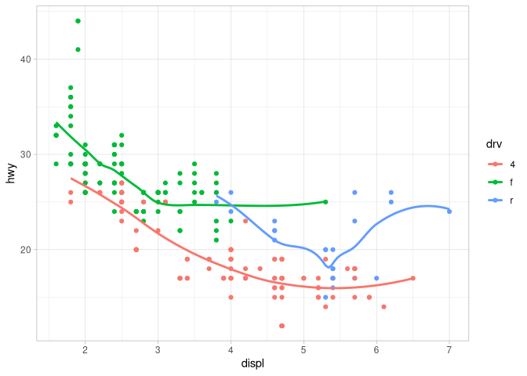

The middle right plot is the same as before but this time with only a
single overall smooth line:

``` r
mpg |> 
  ggplot(aes(displ, hwy)) +
  geom_point(aes(color = drv)) +
  geom_smooth(se = FALSE)
```

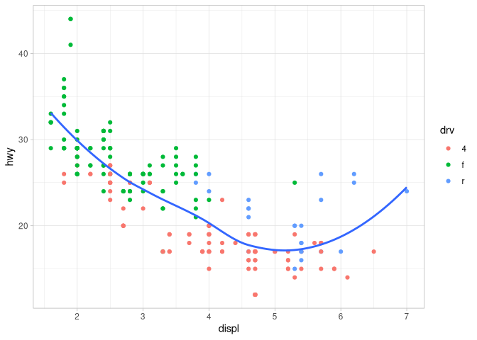

The bottom left plot is the same as before but now there are three
smooth lines again, each with a different linetype:

``` r
mpg |> 
  ggplot(aes(displ, hwy)) +
  geom_point(aes(color = drv)) +
  geom_smooth(aes(linetype = drv), se = FALSE)
```

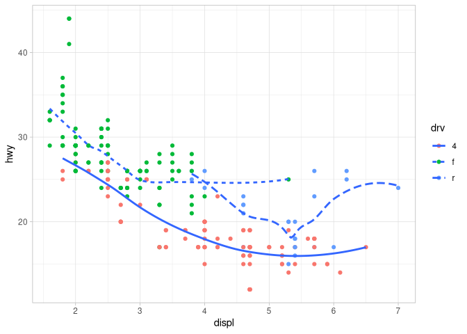

And the final plot has no smooth lines but a white ring for each circle:

``` r
mpg |> 
  ggplot(aes(displ, hwy)) +
  # Define it all especially for the shape.
  geom_point(
    shape = 21,
    aes(fill = drv),
    # Make it grey because the background is white.
    color = "grey90",
    # Make rings thicker
    stroke = 2)
```

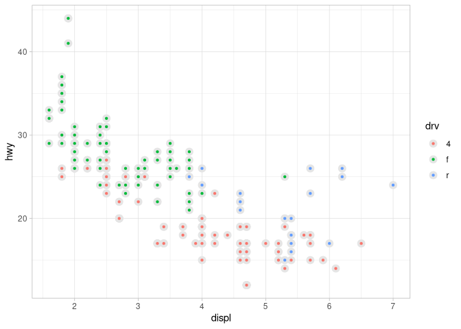

## Facets

So `facet_wrap()` to make facets for the values of one single
categorical variable, and `facet_grid()` is for the combinations of two
categorical variables, hence the double sided formula `y ~ x`.

### Exercises

#### 1. What happens if you facet on a continuous variable?

Let’s try it!

Which are the continuous variables in `mpg`?

``` r
glimpse(mpg)
```

    Rows: 234
    Columns: 11
    $ manufacturer <chr> "audi", "audi", "audi", "audi", "audi", "audi", "audi", "…
    $ model        <chr> "a4", "a4", "a4", "a4", "a4", "a4", "a4", "a4 quattro", "…
    $ displ        <dbl> 1.8, 1.8, 2.0, 2.0, 2.8, 2.8, 3.1, 1.8, 1.8, 2.0, 2.0, 2.…
    $ year         <int> 1999, 1999, 2008, 2008, 1999, 1999, 2008, 1999, 1999, 200…
    $ cyl          <int> 4, 4, 4, 4, 6, 6, 6, 4, 4, 4, 4, 6, 6, 6, 6, 6, 6, 8, 8, …
    $ trans        <chr> "auto(l5)", "manual(m5)", "manual(m6)", "auto(av)", "auto…
    $ drv          <chr> "f", "f", "f", "f", "f", "f", "f", "4", "4", "4", "4", "4…
    $ cty          <int> 18, 21, 20, 21, 16, 18, 18, 18, 16, 20, 19, 15, 17, 17, 1…
    $ hwy          <int> 29, 29, 31, 30, 26, 26, 27, 26, 25, 28, 27, 25, 25, 25, 2…
    $ fl           <chr> "p", "p", "p", "p", "p", "p", "p", "p", "p", "p", "p", "p…
    $ class        <chr> "compact", "compact", "compact", "compact", "compact", "c…

Okay, let’s try to facet by `cty`:

``` r
mpg |> 
  ggplot(aes(displ, hwy)) +
  geom_point() +
  facet_wrap(~cty)
```

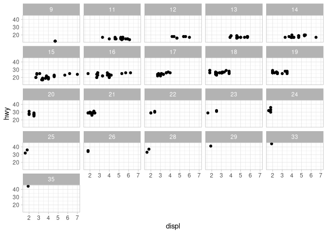

Ah nice, the plots are actually faceted by all the values for which
entries exist. I guess at a certain number the function will stop and
give an error.

#### 2. What do the empty cells in the plot above with `facet_grid(drv ~ cyl)` mean?

> Run the following code. How do they relate to the resulting plot?

> ``` r
> ggplot(mpg) +
>   geom_point(aes(x = drv, y = cyl))
> ```

I think the empty plots mean, that there were no obervations for these
combinations of facet values.

Let’s check out the code example:

``` r
mpg |> 
  ggplot() +
  geom_point(aes(x = drv, y = cyl))
```

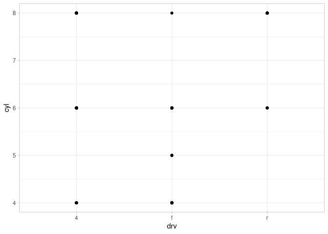

Yes, we can see that for four wheel drives there are no observations
with five cylinders, and for rear wheel drives there are no obervations
with either four, or five cylinders. Also you can see that there are 0
observations with seven cylinders generally.

#### 3. What plots does the following code make?

> What does `.` do?

> ``` r
> ggplot(mpg) + 
>   geom_point(aes(x = displ, y = hwy)) +
>   facet_grid(drv ~ .)
>
> ggplot(mpg) + 
>   geom_point(aes(x = displ, y = hwy)) +
>   facet_grid(. ~ cyl)
> ```

Run both codes and see:

``` r
ggplot(mpg) + 
  geom_point(aes(x = displ, y = hwy)) +
  facet_grid(drv ~ .)
```

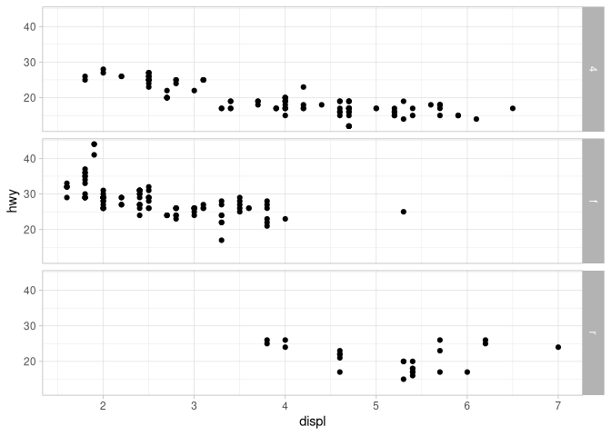

``` r
ggplot(mpg) + 
  geom_point(aes(x = displ, y = hwy)) +
  facet_grid(. ~ cyl)
```

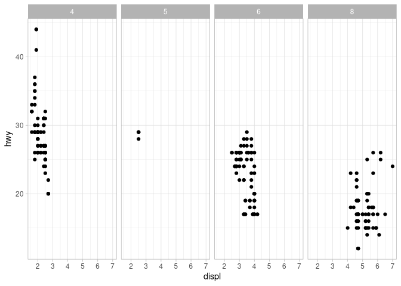

Hmm, I guess it has something to do with the orientation of the plots.
Interestingly, even though `facet_grid()` is called, but with one side
being `.`, there are only facets for the variable actually named.

Let’s take this plot by plot:

``` r
# With "." on the right.
ggplot(mpg) + 
  geom_point(aes(x = displ, y = hwy)) +
  facet_grid(drv ~ .)
```


``` r
# With "." on the left.
ggplot(mpg) + 
  geom_point(aes(x = displ, y = hwy)) +
  facet_grid(. ~ drv)
```

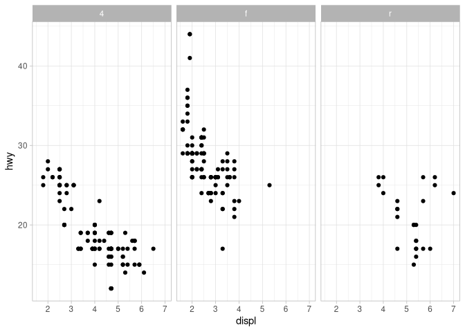

``` r
# Without ".".
ggplot(mpg) + 
  geom_point(aes(x = displ, y = hwy)) +
  facet_wrap(~drv)
```


Seems like the default of `facet_wrap()` is plots from left to right,
and with `facet_grid()` you can define the orientation by placing the
single variable of interest either on either side of the `~` formula
with a `.` on the other.

Check this also with the other plot:

``` r
# This should be left to right.
ggplot(mpg) + 
  geom_point(aes(x = displ, y = hwy)) +
  facet_grid(. ~ cyl)
```


``` r
# This should be top to bottom.
ggplot(mpg) + 
  geom_point(aes(x = displ, y = hwy)) +
  facet_grid(cyl ~ .)
```

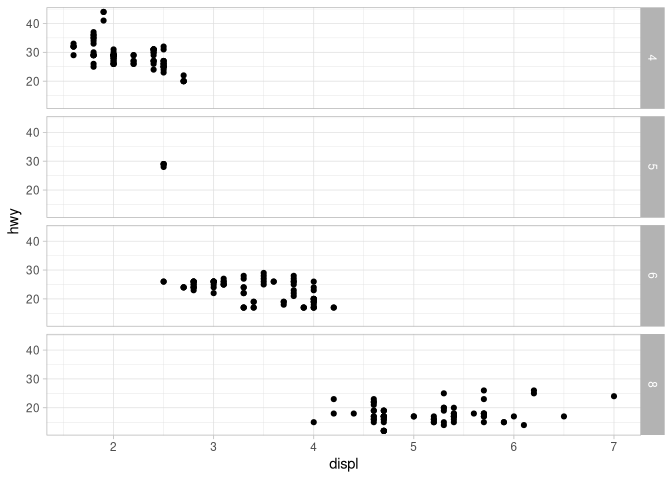

So basically the `.` stands for “nothing”.

#### 4. Take the first faceted plot in this section:

> ``` r
> ggplot(mpg) +
>   geom_point(aes(x = displ, y = hwy)) +
>   facet_wrap(~ cyl, nrow = 2)
> ```

> What are the advantages to using faceting instead of the color
> aesthetic? What are the disadvantages? How might the balance change if
> you had a larger dataset?

Look at the plot:

``` r
mpg |> 
  ggplot(aes(displ, hwy)) +
  geom_point() +
  facet_wrap(~ cyl, nrow = 2)
```

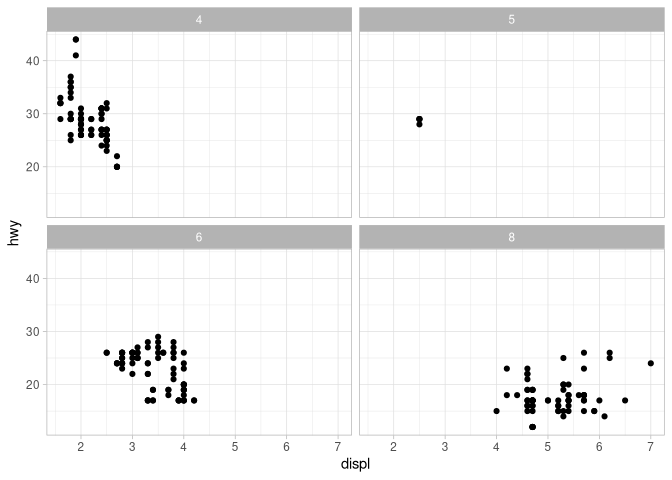

And do the same plot with color aesthetic instead of facet:

``` r
mpg |> 
  # Color by "cyl", but have to put this also as factor to get distinct colors
  ggplot(aes(displ, hwy, color = factor(cyl))) +
  geom_point()
```

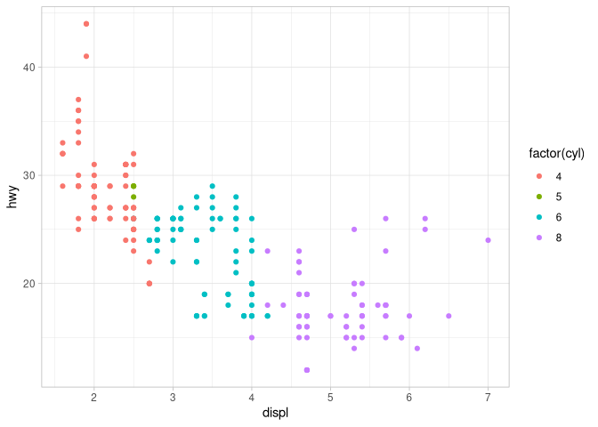

With the facet wrap the individual ranges and sizes of the groups more
interpretable, while with the scatterplot the relation between the
groups is more clear. I think with a larger dataset, meaning more
points, but the same number of categories, the `facet_wrap()` would be
better for both the relationship between and the distribution within the
groups, because the overlapping of values would not conflict with the
visual distinction of the groups.

#### 5. Read `?facet_wrap`.

> What does `nrow` do? What does `ncol` do? What other options control
> the layout of the individual panels? Why doesn’t `facet_grid()` have
> `nrow` and `ncol` arguments?
